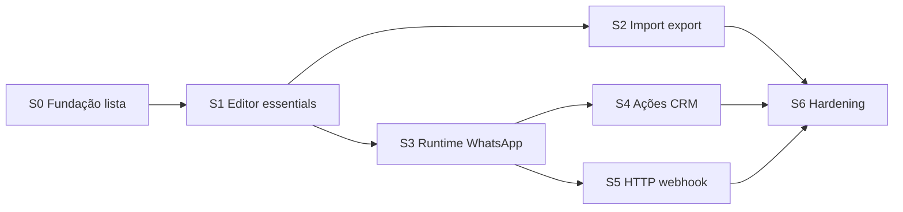

# Plano de sprints — Chatbot Flows (Canvas visual para clientes)

| Campo | Valor |
|-------|-------|
| **Data** | 2026-08-04 |
| **Tipo** | Plano de implementação (módulo tenant) |
| **Nome do recurso** | **Chatbot Flows** — editor visual de fluxos de atendimento |
| **Canvas** | `@xyflow/react` (React Flow) |
| **Escopo** | Multi-tenant (clientes do PainelCRM) |
| **Princípio** | Isolar do `chat-core`; integrar só por eventos/APIs |
| **Status** | S14–S21 · **S21** importer entregue |
| **Continuação** | [`PLAN_SPRINTS_CHATBOT_FLOWS_S36.md`](./PLAN_SPRINTS_CHATBOT_FLOWS_S36.md) (**S36** feito) · [`PLAN_SPRINTS_CHATBOT_FLOWS_S35.md`](./PLAN_SPRINTS_CHATBOT_FLOWS_S35.md) (**S35** feito) · [`PLAN_SPRINTS_CHATBOT_FLOWS_S34.md`](./PLAN_SPRINTS_CHATBOT_FLOWS_S34.md) (**S34** feito) · [`PLAN_SPRINTS_CHATBOT_FLOWS_S32.md`](./PLAN_SPRINTS_CHATBOT_FLOWS_S32.md) (**S32–S33.2** feitos) · histórico S15–S21: [`PLAN_SPRINTS_CHATBOT_FLOWS_S15.md`](./PLAN_SPRINTS_CHATBOT_FLOWS_S15.md) |

---

## 1. Resumo executivo

Criar um módulo em que o cliente do PainelCRM monta **vários fluxos** (flows) com **quadrados ligados** (nós + edges): mensagens, perguntas, condições, ações no CRM, HTTP/webhook e transferência para humano.

O React Flow cobre **apenas o canvas**. Catálogo de nós, persistência, import/export, publish e **runtime** (WhatsApp / UazAPI) são construídos por nós, em sprints.

**Entrega por camadas:** essentials primeiro → ações CRM → integrações → produto (versões, logs, templates).

---

## 2. Objetivos de produto

| Objetivo | Descrição |
|----------|-----------|
| **Vários flows** | Lista CRUD por tenant: criar, renomear, duplicar, arquivar, ativar/desativar |
| **Canvas visual** | Editor estilo Typebot/ManyChat com nós conectáveis |
| **Import / export** | Exportar JSON do flow; importar (criar novo ou sobrescrever draft) |
| **Draft vs publicado** | Editar rascunho sem afetar conversas em produção |
| **Runtime WhatsApp** | Executar flow publicado quando chegar mensagem (sem reescrever chat-core) |
| **Fail-safe** | Erro / nó inválido → transferir humano ou encerrar (não travar conversa) |

---

## 3. Fora de escopo (este plano)

- Fork/embed de Typebot, Botpress ou n8n
- Builder no Super Admin (Program Meta oficial) — outro programa
- IA generativa como nó (fase futura opcional)
- Multi-canal além de WhatsApp UazAPI no MVP (Instagram/e-mail depois)
- Substituir atendimento humano / kanban existentes

---

## 4. Arquitetura (sem quebrar o chat)

```text
[UI Tenant]
  Lista de flows  →  Editor (@xyflow/react)  →  Import/Export JSON
        │                      │
        ▼                      ▼
[API / Postgres]
  chatbot_flows · chatbot_flow_versions · chatbot_flow_sessions
        │
        ▼
[Runtime worker — isolado]
  consome: mensagem recebida (hook pontual)
  produz: enviar mensagem · tag · atribuir · HTTP · transferir humano
        │
        ▼
[chat-core / UazAPI]  ← apenas via APIs/eventos existentes
```

### Regras de isolamento

1. Feature flag por tenant (ex.: `chatbot_flows.enabled`).
2. Código em `src/features/chatbot-flows/` + `packages/backend/.../chatbotFlows/`.
3. **Não** alterar o store SoT do `chat-core` além de um bridge fino (evento “message inbound” / “send outbound”).
4. Sessão do bot (`conversation_id` + `current_node_id` + variáveis) **separada** do grafo publicado.

---

## 5. Modelo de dados (alvo)

| Entidade | Papel |
|----------|--------|
| `chatbot_flows` | Cabeçalho: nome, status (`draft` / `active` / `archived`), tenant, trigger |
| `chatbot_flow_versions` | Snapshot imutável: `graph_json` (nodes + edges), `version`, `published_at` |
| `chatbot_flow_sessions` | Runtime por conversa: flow_version_id, nó atual, variáveis, estado |
| (opcional) `chatbot_flow_runs` / logs | Auditoria por passo |

**Triggers (MVP):** palavra-chave · primeira mensagem · manual (botão no chat) · (S3+) tag / coluna kanban.

**Contrato do grafo (export/import):**

```json
{
  "format": "painelcrm.chatbot_flow",
  "format_version": 1,
  "exported_at": "ISO-8601",
  "flow": {
    "name": "Boas-vindas",
    "trigger": { "type": "keyword", "value": "oi" }
  },
  "graph": {
    "nodes": [{ "id": "n1", "type": "send_message", "position": { "x": 0, "y": 0 }, "data": { "text": "Olá!" } }],
    "edges": [{ "id": "e1", "source": "n1", "target": "n2", "sourceHandle": "default" }]
  }
}
```

Import rejeita `format` desconhecido ou `format_version` maior que o suportado.

---

## 6. Catálogo de nós (fases)

| Fase | Nós | Notas |
|------|-----|--------|
| **S0–S1** | `start`, `send_message`, `wait_input`, `condition`, `transfer_human`, `end` | Essentials |
| **S2** | `set_variable`, `add_tag`, `assign_agent`, `move_kanban`, `delay` | Ações CRM |
| **S3** | `http_request`, `webhook_out` | Integrações |
| **S4+** | `menu_buttons` (se canal permitir), templates, AI (opcional) | Produto |

Cada nó: `type` estável + `data` validado com Zod + handles de saída nomeados (`default`, `true`/`false`, `error`).

---

## 7. Visão dos sprints

| Sprint | Nome | Objetivo | Depende |
|--------|------|----------|---------|
| **S0** | Fundação + lista multi-flow | Módulo, feature flag, CRUD flows, canvas stub | — |
| **S1** | Essentials no editor + draft/publish | Nós MVP no canvas, validação, publicar versão | S0 |
| **S2** | Import / export + duplicar | JSON portável, clonar flow, UX lista | S1 |
| **S3** | Runtime WhatsApp (MVP) | Sessão + execução essentials no canal | S1 |
| **S4** | Ações CRM | Tags, atribuição, kanban, delay, variáveis | S3 |
| **S5** | HTTP / webhook | Nós de integração + secrets seguros | S3 |
| **S6** | Hardening produto | Logs, observabilidade, templates, QA go-live | S2–S5 |

Duração indicativa: **1–2 semanas** por sprint (ajustar à capacidade).  
S2 pode avançar em paralelo a S3 após S1 (export não depende de runtime).



---

## 8. Detalhe por sprint

### S0 — Fundação + lista multi-flow

**Meta:** o cliente vê o módulo e gerencia **vários** flows, sem execução real.

#### Entregas

1. Feature flag `chatbot_flows` (módulo / permissão `chatbot_flows.view` + `edit`).
2. Rotas UI: lista `/chatbot-flows`, editor `/chatbot-flows/:id`.
3. Nav (sidebar / mobile quick access) atrás da flag.
4. Migrations: `chatbot_flows` (+ campos mínimos); API list/create/rename/archive.
5. Canvas stub com `@xyflow/react`: nós placeholder Início / Fim.
6. Persistência mínima do grafo no draft (salvar posição + types stub).

#### Critérios de aceite

- [x] Tenant com flag vê lista; sem flag → 404/oculto *(API `requireFeature` + nav/RequireModuleView)*
- [x] Criar 2+ flows com nomes distintos
- [x] Abrir editor, mover nós, salvar e reabrir mantém posições
- [x] Arquivar oculta da lista padrão (filtro “arquivados”)

#### Fora de S0

- Publish / runtime / import-export / nós com formulário completo

---

### S1 — Essentials no editor + draft/publish

**Meta:** montar um flow útil no canvas e **publicar** versão imutável (ainda sem WhatsApp).

#### Entregas

1. Nós UI + Zod: `start`, `send_message`, `wait_input`, `condition`, `transfer_human`, `end`.
2. Painel lateral de propriedades por nó (shadcn).
3. Validação ao publicar: 1 `start`, sem nós órfãos críticos, edges válidos.
4. `chatbot_flow_versions` + ação **Publicar** / **Voltar ao draft** (editar draft ≠ mexer na publicada).
5. Badge na lista: Rascunho / Publicado / Desatualizado (draft ≠ last published).
6. Trigger configurável no `start` (keyword / first_message) — só persistência.

#### Critérios de aceite

- [x] Flow com mensagem → pergunta → condição → humano/fim publica sem erro
- [x] Publicar cria versão N; editar depois não altera JSON da versão N
- [x] Publish bloqueado se grafo inválido (toast + highlights)

#### Fora de S1

- Execução em conversa real; HTTP; import JSON

---

### S2 — Import / export + duplicar

**Meta:** o cliente leva flows entre ambientes / backups e multiplica templates.

#### Entregas

1. **Export:** download `.json` no contrato `painelcrm.chatbot_flow` v1 (sem secrets).
2. **Import:** upload → preview (nome, nº nós) → criar **novo** flow (default) ou substituir draft (opção explícita).
3. **Duplicar** na lista (copia draft + opcional última publicada como draft).
4. Sanitização: strip de URLs/headers sensíveis se houver campos futuros; rejeitar payload malformado.
5. UX: botões Exportar / Importar / Duplicar na lista e no editor.

#### Critérios de aceite

- [x] Export → import em outro tenant (ou mesmo) cria flow equivalente no canvas
- [x] Import com `format_version` futura → erro claro
- [x] Duplicar não altera o flow original nem sessões

#### Fora de S2

- Marketplace de templates da plataforma (S6 opcional)

---

### S3 — Runtime WhatsApp (MVP)

**Meta:** flow **publicado** responde no WhatsApp sem quebrar atendimento humano.

#### Entregas

1. `chatbot_flow_sessions` + worker/handler de passo.
2. Bridge inbound: mensagem recebida → se sessão ativa ou trigger match → runtime.
3. Handlers: `send_message`, `wait_input` (pausa), `condition`, `transfer_human`, `end`.
4. Convivência: se agente humano assume / conversa em atendimento manual → **pausar ou encerrar** sessão bot (regra de produto fechada neste sprint).
5. Feature flag runtime separada (ex.: `chatbot_flows.runtime`) para ligar por tenant.
6. Testes unitários dos handlers + 1 E2E staging (keyword → 2 mensagens → fim).

#### Critérios de aceite

- [x] Keyword dispara flow publicado
- [x] `wait_input` espera próxima mensagem do contato e avança
- [x] `transfer_human` deixa conversa acionável no chat/kanban
- [x] Desligar flag runtime para o bot imediatamente (fail closed)

#### Fora de S3

- HTTP/webhook; ações kanban avançadas; simulação no editor

---

### S4 — Ações CRM

**Meta:** o flow opera o CRM, não só conversa.

#### Entregas

1. Nós: `set_variable`, `add_tag`, `assign_agent` / fila, `move_kanban` (coluna), `delay`.
2. Interpolação simples `{{var}}` em `send_message`.
3. Delay via job agendado (respeitar timezone tenant se já existir padrão).
4. Permissões: só ações que o tenant/módulo já permite.

#### Critérios de aceite

- [x] Flow adiciona tag e move card kanban em staging
- [x] Variável capturada em `wait_input` aparece na mensagem seguinte
- [x] Delay de N minutos agenda e retoma sessão

---

### S5 — HTTP / webhook

**Meta:** integrações externas com segurança multi-tenant.

#### Entregas

1. Nó `http_request` (método, URL, headers, body, map response → variáveis).
2. Nó `webhook_out` (POST assinado ou secret por flow — sem vazar no export).
3. Timeouts, status HTTP, edge `error`.
4. Allowlist opcional de domínios (config tenant) — decisão de produto no sprint.
5. Secrets **nunca** no JSON de export (placeholder + reconfigurar após import).

#### Critérios de aceite

- [x] HTTP 200 grava variável e segue; 5xx vai para handle `error` *(engine + runner sync resume)*
- [x] Export não contém Authorization/token em claro *(sanitize headers array + secret)*
- [x] Webhook out dispara para URL de teste (webhook.site / staging) *(nó + HMAC `X-PainelCRM-Signature`)*

**Notas S5:** allowlist opcional via env `CHATBOT_FLOWS_HTTP_HOST_ALLOWLIST` (CSV de hosts); SSRF bloqueia localhost/RFC1918 sempre. Migration `312_chatbot_flow_http.sql` (`waiting_http`).

**Webhook in (entrada):** nó `webhook_in` na categoria Início; URL pré-gerada `/webhooks/chatbot-flows/:token` (token regenerável); secret HMAC opcional; body exige `conversation_id`; ativa na versão publicada (`inbound_webhook_token`, migration `313`).

---

### S6 — Hardening / go-live clientes

**Meta:** seguro para oferecer como recurso de produto.

#### Entregas

1. Log/histórico por sessão (últimos N passos) na UI.
2. Simulador no editor (“Testar flow” sem WhatsApp) — mínimo: percorrer nós síncronos.
3. 2–3 templates oficiais (Boas-vindas, Horário comercial, Qualificação lead) instaláveis via import.
4. Observabilidade: métricas/contadores (flows ativos, sessões, erros).
5. Docs internas + checklist QA; rate limit de sessões por tenant.
6. Runbook: desligar flag, arquivar flow, cancelar sessões abertas.

#### Critérios de aceite

- [ ] Matriz QA verde em staging (lista, editor, import/export, runtime, fail-safe)
- [ ] Rollback = flag off em &lt; 5 min
- [ ] Templates importáveis sem erro

#### S6-UI (parcial — canvas visual)

Entrega antecipada de polish visual no editor (independente do hardening):

- [x] Cards com header colorido + ícone por tipo (estilo Typebot)
- [x] Edges ortogonais (`smoothstep`) com animação de “trânsito” (dash)
- [x] Cor diferenciada: caminho `true`/ok (verde) vs `false`/erro (vermelho)

---

### S7 — Testar fluxo (simulador no editor)

**Meta:** o cliente valida o rascunho sem WhatsApp real (estilo n8n).

#### Entregas

1. Botão **Testar** abaixo do + Nós no canvas.
2. Painel de simulação: chat fake + log de etapas (ok / wait / erro).
3. Motor FE espelhando `processInboundStep` (dry-run).
4. Delay auto-avançado; HTTP/webhook pedem OK/Erro manual.
5. Highlight dos nós no canvas durante o teste.
6. CRM (tag/kanban/atribuir) só loga dry-run — sem side-effect.

#### Critérios de aceite

- [x] Iniciar teste percorre mensagem → pergunta → resposta do usuário
- [x] Nó atual destacado; etapas listadas com ok
- [x] HTTP pausa e segue por ok/erro escolhido
- [x] Não altera conversas/kanban reais

**Próximos:** S6 hardening (logs/templates/métricas) ou próximos itens de produto

---

### S8 — Webhook out: payload configurável

**Meta:** o cliente escolhe o que o `webhook_out` envia (sem perder o padrão estável).

#### Entregas

1. `payload_mode`: `envelope` | `envelope_plus` | `custom`
2. `body_template` com `{{variáveis}}` (JSON em `data` ou body inteiro)
3. Envelope padrão mantido: `event`, `tenant_id`, `conversation_id`, `sent_at`, `variables`
4. UI no painel do nó + runtime + testes

#### Critérios de aceite

- [x] Modo padrão = comportamento S5
- [x] Modo envelope+data = template vira `data`
- [x] Modo custom = body só o template interpolado
- [x] Secret HMAC continua assinando o body final

---

### S9 — Inventário / fonte única de variáveis

**Meta:** descobrir o que já existe no PainelCRM e definir um catálogo único (metadados) antes do picker (S10).

#### Entregas

1. Investigação cross-módulo (flows, chat templates, kanban, contratos, notif, propostas, Meta HSM).
2. Doc: `docs/chatbot-flows/VARIABLES_CATALOG_INVESTIGATION.md`.
3. Catálogo seed: `packages/backend/src/services/templateVariables/catalog.ts` + espelho FE `src/lib/templateVariables/catalog.ts`.
4. Categorias: `flow_session`, `contact`, `conversation`, `agent`, `tenant`, `system` (com aliases legados).

#### Critérios de aceite

- [x] Inventário documentado (não havia fonte única; ~8 sistemas)
- [x] Catálogo tipado com scopes (incl. `chatbot_flows`)
- [x] Blueprint: reusar padrão contratos; S10 = seed runtime + picker

---

### S10 — Aplicar variáveis nos nós (seed + picker)

**Meta:** variáveis do catálogo disponíveis no runtime e inseríveis na UI dos nós.

#### Entregas

1. BE: `flowVariableContext.ts` — seed contact/conversation/agent/tenant/system (+ aliases) ao criar/atualizar sessão e no webhook in.
2. Interpolação com chaves dotted (`[\w.]+`) no BE e no motor FE.
3. UI: `VariableTextField` (botão **Variáveis**) nos textareas/inputs de mensagem, pergunta, transfer, set_variable, HTTP e webhook out.
4. Simulador (S7): seed mock via `mockVariableSeed.ts` ao iniciar teste.

#### Critérios de aceite

- [x] Sessão WhatsApp/webhook recebe bag de variáveis CRM/sistema sem sobrescrever vars do flow
- [x] `{{contact.name}}` / aliases (`{{contact_name}}`) interpolam no runtime
- [x] Picker no painel de propriedades insere token no cursor
- [x] Simulador mostra vars mock e interpola mensagens com elas

---

### S11 — Faturas CRM no flow (consulta → escolha → envio)

**Meta:** o contato consulta faturas em aberto e recebe o link `/pay/{token}` sem reinventar gateway.

#### Entregas

1. Nós CRM: `lookup_invoice` (última aberta | menu) e `select_invoice` (escolhe pelo número digitado).
2. BE: `flowInvoiceActions.ts` — resolve `conversation → client_id` (fallback telefone), `listInvoices` open statuses, vars `invoice.*`.
3. Handles: lookup `achou`/`vazia`; select `ok`/`inválida`. Envio via `send_message` + `{{invoice.public_link}}`.
4. Catálogo: categoria `invoice` + `client.id`; simulador dry-run Achou/Nenhuma.

#### Critérios de aceite

- [x] Conversa com cliente + fatura aberta → vars + link público
- [x] Sem cliente / sem fatura → saída vazia (não erro de runtime)
- [x] Menu + pergunta + select preenche a fatura escolhida
- [x] Simulador dry-run sem tocar DB real

---

### S11.1 — Nó único `invoice_assist` (Faturas)

**Meta:** um nó faz consulta + mensagem/lista + espera da escolha + envio do link.

#### Entregas

1. Nó `invoice_assist` na paleta CRM (substitui UX dos 2 tijolos).
2. Modos: `last_open` (consulta → manda link) e `open_menu` (consulta → prompt+menu → espera → link).
3. Templates: `prompt_template`, `link_template`, `empty_message`, `invalid_message` + `max_invalid`.
4. Saídas: `default` | `empty` | `invalid` (após N tentativas no menu).
5. `lookup_invoice` / `select_invoice` permanecem no runtime (compat) mas saem da paleta.

#### Critérios de aceite

- [x] Menu: Achou → bot lista → usuário digita 1 → bot manda `/pay/…`
- [x] Última aberta: Achou → bot manda link sem pergunta
- [x] Vazia / inválida (após tentativas) seguem handles dedicados
- [x] Simulador dry-run (Achou/Nenhuma + resposta)

---

### S12 — Testar com cliente/lead real

**Meta:** no painel ▶ Testar, escolher um cliente ou lead de exemplo (faturas usam o cliente).

#### Entregas

1. Picker Mock | Cliente | Lead antes de iniciar.
2. Seed de `contact.*` / `client.id` a partir da seleção.
3. Com cliente: lookup de faturas chama `GET /api/customer-invoices` (abertas reais) e auto-resolve no dry-run.
4. Lead: só contexto de contato; faturas continuam mock.

#### Critérios de aceite

- [x] Selecionar cliente e testar nó Faturas lista cobranças reais em aberto
- [x] Sem seleção = comportamento mock anterior
- [x] Lead preenche nome/telefone sem exigir client_id

---

### S13 — Menu / IF (UazAPI)

**Meta:** nó com botões ou lista interativa WhatsApp e ramificações por opção (estilo IF do n8n), com `set_variables` por caminho.

#### Entregas

1. Nó `menu_choice` na paleta Mensagens: modo `button` (≤3) ou `list` (≤10).
2. Cada opção: `id` (handle), `label`, descrição/seção (lista), `set_variables[]`.
3. Saídas dinâmicas: um handle por `option.id` + `fallback` (após `max_invalid` tentativas).
4. Runtime: UazAPI `POST /send/menu`; fallback texto numerado se falhar; match por `buttonOrListid` / label / número.
5. Simulador: botões clicáveis + digitação livre; dry-run sem side-effect.

#### Critérios de aceite

- [x] Publicar flow com menu e ramificar por opção no WhatsApp
- [x] Clique no botão/lista preenche variável e segue o handle da opção
- [x] Resposta inválida N vezes → saída `fallback`
- [x] Simulador clica nas opções e segue o branch correto

---

### S14 — Teste HTTP / webhook no editor (sample → variáveis)

**Meta:** no painel do nó, testar a integração de verdade, ver a resposta e mapear campos para variáveis com um clique (estilo n8n).

#### Entregas

1. Endpoint autenticado `POST /api/chatbot-flows/test-integration` (SSRF/allowlist do runtime).
2. Botão **Testar** em `http_request` e `webhook_out`; sample `last_test_*` no draft do nó.
3. Árvore JSON clicável → criar variável no `response_map` (lista amigável no painel).
4. Sample **não** vai para publish/export (`stripEditorSamplesFromGraph` / `sanitizeGraph`).
5. Simulador: botão **Usar última resposta** quando o nó tem sample.

#### Critérios de aceite

- [x] Testar HTTP no painel mostra status + body
- [x] Clique no campo cria map path → variável
- [x] Publish/export remove `last_test_*`
- [x] ▶ Testar pode seguir com a última resposta mapeada
- [x] **Map aplica em qualquer status** (200/201/4xx/5xx): `response_map` / `status_variable` / `response_variable` e sample Fixar/última resposta funcionam independentemente do código; roteamento continua 2xx→`default`, demais→`error` (vars nos dois caminhos)

---

## 9. Decisões de produto (a fechar antes/durante sprints)

| ID | Tema | Opções | Sugestão |
|----|------|--------|----------|
| **D1** | Humano vs bot | Pausar bot / Encerrar sessão / Ignorar bot se atendimento aberto | Pausar sessão bot ao assumir humano |
| **D2** | 1 flow ativo por trigger | Vários flows competem / prioridade / só 1 keyword única | Keyword única por tenant no MVP |
| **D3** | Import sobrescreve | Só cria novo / permite replace draft | Default = criar novo |
| **D4** | Export de HTTP | Strip secrets sempre | Sempre strip |
| **D5** | Canal | Só UazAPI WhatsApp no MVP | Sim |

---

## 10. Riscos e mitigação

| Risco | Mitigação |
|-------|-----------|
| Contaminar `chat-core` | Bridge fino + flag; code review barrando edits amplos no store |
| Bot e humano brigam | D1; testes de convivência em S3 |
| Scope creep de nós | Catálogo por sprint; PRs sem nó fora da fase |
| Import malicioso (SSRF via HTTP) | Allowlist / block private IPs em S5 |
| Performance canvas grande | Lazy load editor; limite soft de nós no MVP (ex. 100) |
| Multi-tenant leak | `tenant_id` em todas as queries; testes de isolamento |

---

## 11. Definition of Done (módulo para clientes)

- [ ] Cliente cria **vários** flows, edita no canvas, publica
- [ ] **Import e export** JSON estáveis (`format_version` 1)
- [ ] Runtime essentials no WhatsApp com fail-safe
- [ ] Feature flags permitem ligar/desligar sem deploy emergencial
- [ ] Documentação de nós + runbook
- [ ] Nenhuma regressão no chat/kanban existentes (smoke)

---

## 12. Stack e pastas sugeridas

| Camada | Sugestão |
|--------|----------|
| Canvas | `@xyflow/react` |
| Validação | Zod (já no monorepo) |
| UI | shadcn / Radix existentes |
| Frontend | `src/features/chatbot-flows/` |
| Backend | `packages/backend/src/services/chatbotFlows/` |
| Docs | este arquivo + ADRs futuros em `docs/chatbot-flows/` |

---

## 13. Ordem de implementação recomendada (resumo)

1. **S0–S1** — lista multi-flow + editor essentials + publish  
2. **S2** — import / export / duplicar (valor imediato para o cliente)  
3. **S3** — runtime WhatsApp MVP  
4. **S4–S5** — CRM + HTTP  
5. **S6** — go-live  

---

## 14. Próximo passo operacional

1. S15–S21 entregues — ver [`PLAN_SPRINTS_CHATBOT_FLOWS_S15.md`](./PLAN_SPRINTS_CHATBOT_FLOWS_S15.md).  
2. **Fase regras de início:** [`PLAN_SPRINTS_CHATBOT_FLOWS_S22.md`](./PLAN_SPRINTS_CHATBOT_FLOWS_S22.md) (**S22–S24** no código).  
3. **Fase tickets:** [`PLAN_SPRINTS_CHATBOT_FLOWS_S25.md`](./PLAN_SPRINTS_CHATBOT_FLOWS_S25.md) (**S25–S25.2** no código) · suporte [`SUPPORT_TICKET_FLOW.md`](./SUPPORT_TICKET_FLOW.md).  
4. **Fase vínculo CRM:** [`PLAN_SPRINTS_CHATBOT_FLOWS_S26.md`](./PLAN_SPRINTS_CHATBOT_FLOWS_S26.md) (**S26–S26.1** no código).  
5. **Fase Webhook in (map + listen):** [`PLAN_SPRINTS_CHATBOT_FLOWS_S27.md`](./PLAN_SPRINTS_CHATBOT_FLOWS_S27.md) (**S27** · **S27.1** feitos).  
6. **Fase Webhook estável + abrir conversa:** [`PLAN_SPRINTS_CHATBOT_FLOWS_S28.md`](./PLAN_SPRINTS_CHATBOT_FLOWS_S28.md) (**S28 · S28.1 · S29 · S29.1** feitos; **S30 skip**; **S31** tag/opt-out feito — [`PLAN_SPRINTS_CHATBOT_FLOWS_S31.md`](./PLAN_SPRINTS_CHATBOT_FLOWS_S31.md)) · detalhe S29/S29.1: [`PLAN_SPRINTS_CHATBOT_FLOWS_S29.md`](./PLAN_SPRINTS_CHATBOT_FLOWS_S29.md) · decisão S30: [`PLAN_SPRINTS_CHATBOT_FLOWS_S30.md`](./PLAN_SPRINTS_CHATBOT_FLOWS_S30.md).  
7. **Fase mídia inbound + Media Library:** [`PLAN_SPRINTS_CHATBOT_FLOWS_S32.md`](./PLAN_SPRINTS_CHATBOT_FLOWS_S32.md) (**S32 · S32.1 · S33 · S33.1 · S33.2** feitos — captura + cópia temp + Media Library + picker composer/produtos/`send_message`; Drive sync opt-in adiado).
8. **S34 — sequência em `send_message`:** [`PLAN_SPRINTS_CHATBOT_FLOWS_S34.md`](./PLAN_SPRINTS_CHATBOT_FLOWS_S34.md) (**feito** — bloco de msgs + `delay_after`; reabre atalho UX do S30).
9. **S35 — convert no Testar + lead ao gravar contato:** [`PLAN_SPRINTS_CHATBOT_FLOWS_S35.md`](./PLAN_SPRINTS_CHATBOT_FLOWS_S35.md) (**feito**).
10. **S36 — CPF/CNPJ no lead:** [`PLAN_SPRINTS_CHATBOT_FLOWS_S36.md`](./PLAN_SPRINTS_CHATBOT_FLOWS_S36.md) (**feito**).
11. Manter decisões **D1–D5**; D15.x · D22.x–D24.x · **D25.x** · **D26.x** · **D27.x** · **D28.x** · **D29.x** · **D30.x** · **D31.x** · **D32.x** · **D34.x** · **D35.x** · **D36.x**.
