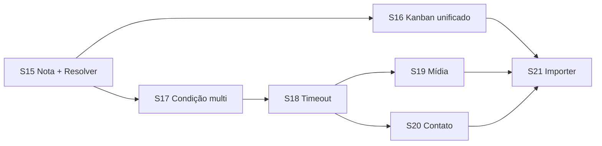

# Plano de sprints — Chatbot Flows S15+ (paridade operacional + evolução)

| Campo | Valor |
|-------|-------|
| **Data** | 2026-08-04 |
| **Tipo** | Plano de implementação (continuação) |
| **Base** | [`PLAN_SPRINTS_CHATBOT_FLOWS.md`](./PLAN_SPRINTS_CHATBOT_FLOWS.md) (S0–S14 entregues) |
| **Nome** | **Chatbot Flows — Paridade operacional** + recursos avançados |
| **Escopo** | Multi-tenant (clientes do PainelCRM) |
| **Princípio** | 1 sprint = 1 tema; nó só entra com runtime WhatsApp; importer externo no fim |
| **Status** | S15–S21 · **S21** importer entregue · fase S15–S21 concluída · **próximo:** [`PLAN_SPRINTS_CHATBOT_FLOWS_S22.md`](./PLAN_SPRINTS_CHATBOT_FLOWS_S22.md) |

---

## 1. Contexto

O módulo já cobre essentials, CRM básico (`add_tag`, `assign_agent`, `move_kanban`, `delay`), HTTP/webhook, menu/IF, faturas, versões e teste HTTP no editor.

Comparando com flows comerciais reais (ex.: export de outro builder estilo “Fluxo Safe”), ainda faltam capacidades que **fecham o ciclo operacional**:

| Capacidade | Situação hoje |
|------------|---------------|
| Nota interna na conversa | Não existe nó |
| Resolver / encerrar atendimento | Só `end` / `transfer_human` |
| Criar / mover card no kanban | Unificado em `move_kanban` (existe→move; ausente→cria; vínculo conversa) |

| Condição multi-caso + else | `condition` com 1 regra |
| Timeout / inatividade em pergunta e menu | Não há |
| Mídia em mensagem | Só texto |
| Gravar resposta em contato / campo | Só variável de sessão |
| Import de JSON de outro sistema | Só `painelcrm.chatbot_flow` v1 |

Este plano cobre **S15–S21** para fechar essa lacuna e depois permitir importer parcial.

---

## 2. Objetivos

1. Bot consegue **anotar**, **criar card**, **mover**, **resolver** e **transferir** sem o agente fazer à mão.
2. Lógica de ramificação mais rica (multi-caso + else).
3. Sessões não ficam eternas (timeout / inatividade).
4. Mensagens com mídia quando o canal UazAPI já permite.
5. Captura de dados no CRM (contato / campos), não só `session.variables`.
6. (Opcional, último) Adaptador de import de formato estrangeiro, com relatório do que não mapeou.

**Não é objetivo deste plano:** fork de Typebot/n8n, IA generativa como nó, multi-canal além de WhatsApp UazAPI.

---

## 3. Princípios de execução

1. **Runtime primeiro** — canvas sem handler no `flowRuntimeEngine` / runner não fecha sprint.
2. **Reusar APIs do PainelCRM** — nota, attendance closed, `chatKanban.createCard`, etc.; não reinventar CRM.
3. **IDs estáveis no grafo** — handles de menu/condição por `id` (não só índice `opt:0`), para edges não quebrarem ao reordenar.
4. **Export limpo** — secrets e samples de teste continuam stripados.
5. **Importer externo só em S21** — depois dos nós P0/P1 estáveis.
6. **Simulador** — cada nó novo precisa de dry-run mínimo (ou skip explícito documentado).

---

## 4. Catálogo de nós (S15+)

| Sprint | `type` (estável) | Label UI | Handles |
|--------|------------------|----------|---------|
| S15 | `conversation_note` | Nota interna | `default` |
| S15 | `resolve_conversation` | Resolver | *(terminal — sem saída)* |
| S15a | `sticky_note` | Sticky note | *(editor-only)* |
| S15a | `annotation_arrow` | Seta | *(editor-only)* |
| S16 | `move_kanban` | Kanban (cria ou move) | `default`, `error` (opcional) |
| S17 | `condition` (evolução) | Condição | `case:{id}`, `else` |
| S18 | (evolução) `wait_input`, `menu_choice` | + timeout / inatividade | + handle `timeout` (opcional) |
| S19 | (evolução) `send_message` | + mídia | `default` |
| S20 | (evolução) `wait_input` | + gravar em contato | `default` |
| S21 | — | Importer formato estrangeiro | — |

Aliases de import (S21): `message`→`send_message`, `open_question`→`wait_input`, `options`→`menu_choice`, `transfer_to_human`→`transfer_human`, `wait`→`delay`, `pipeline_add_card`→`kanban_add_card`, `pipeline_move_card`→`move_kanban`, `contact_label_add`→`add_tag`.

---

## 5. Visão dos sprints

| Sprint | Nome | Objetivo | Depende |
|--------|------|----------|---------|
| **S15** | Nota + resolver | Ciclo de atendimento no chat | S3+ |
| **S16** | Kanban unificado | Cria se ausente / move se existe (conversa) | S4 (`move_kanban`) |
| **S17** | Condição multi-caso | Ramificações reais | S1 `condition` |
| **S18** | Timeout / inatividade | Fail-safe de sessão | S13 menu + `wait_input` |
| **S19** | Mídia na mensagem | Imagem/doc/áudio no bot | UazAPI send media |
| **S19.1** | Doc + áudio | Completar tipos no helper Kanban | `sendKanbanAutomationOutboundMedia` |
| **S20** | Salvar em contato | Dados no CRM, não só sessão | modelo contato/campos |
| **S21** | Importer externo | Migrar drafts de outro builder | S15–S18 (mín.) |

Duração indicativa: **3–7 dias úteis** por sprint (S17/S20/S21 podem ir a ~1–1,5 semana).

S15 e S17 podem avançar em paralelo se houver duas frentes (CRM chat vs engine de condição).

---

## 6. Detalhe por sprint

### S15 — Nota interna + resolver conversa

**Meta:** o flow registra contexto para o humano e encerra o atendimento quando o bot conclui.

#### Entregas

1. Nó `conversation_note`
   - `data`: `text` (template `{{var}}`), opcional `visibility: internal`.
   - Runtime: cria nota/mensagem interna na conversa (mesmo padrão do chat humano; **não** envia ao WhatsApp).
2. Nó `resolve_conversation`
   - `data`: `message` opcional (texto ao contato antes de fechar), `close_attendance: true` (default).
   - Runtime: encerra sessão do bot + aplica `attendance_status` / fluxo de fechamento já usado no chat (`chatAttendance`).
3. UI: propriedades + ícones na paleta (categoria CRM / Encerramento).
4. Engine + runner + validação publish + dry-run no simulador (system line “Nota criada” / “Conversa resolvida”).
5. Encerrar sessão: `session.status = ended` (ou equivalente) após resolve.

#### Critérios de aceite

- [x] Nota aparece no histórico interno da conversa em staging, sem mensagem no WhatsApp do contato *(impl: `crm_notes` + emit; validar UI staging)*
- [x] Resolve fecha atendimento e a sessão do bot não continua respondendo *(impl: `attendance_status=closed` + `session.status=ended`)*
- [x] Mensagem opcional pré-resolve é enviada ao contato quando preenchida
- [x] Publish/export validam schema; nós órfãos continuam barrados

**Decisões fechadas:** D15.1 `end` = só sessão bot; `resolve` = sessão + attendance. D15.2 nota = `crm_notes` (`note_type: internal`), não `chat_messages`.

#### Fora de S15

- Criar card; multi-condição; timeout

---

### S15a — Sticky notes + setas no quadro (editor-only)

**Meta:** documentar o canvas como no n8n/Excalidraw, sem afetar runtime WhatsApp.

#### Entregas

1. Nó `sticky_note` — texto editável (double-click), cores, redimensionável (`NodeResizer`); sem handles.
2. Nó `annotation_arrow` — seta livre (início = posição do nó; ponta arrastável); cor + rótulo opcional.
3. Paleta **Anotações**; validação publish ignora órfão/alcance; runner/simulador filtram esses tipos.
4. Persistidos no `draft_graph` / export (documentação do flow).

#### Critérios de aceite

- [x] Sticky no canvas com cor + resize + texto
- [x] Seta livre ajustável no quadro
- [x] Publish com stickies/setas não falha por órfão
- [x] Runtime WhatsApp ignora anotações

#### Fora de S15a

- Organizador/grupo de sessão; salvar modelo de seção (futuro S22)

---

### S16 — Kanban unificado (`move_kanban`)

**Meta:** lead/cliente entra ou avança no pipeline a partir do bot (um único nó).

#### Entregas

1. Nó `move_kanban` (paleta CRM — **Kanban**)
   - `data`: `board_id?`, `column_id`, `title?`, `description?`, `tag_id?` / `tag_label?`
   - Runtime (`runtimeEnsureKanbanCard`): vínculo = **`conversation_id`** da sessão
     - card **existe** no board → **move** para a coluna
     - card **não existe** → **cria** (INSERT com `conversation_id`)
   - Vars: `kanban.card_id`, `kanban.board_id`, `kanban.column_id`, `kanban.created`, `kanban.moved`
2. Handle `error` opcional (UI dual); publish exige só `default` (compat drafts antigos).
3. UI: board/coluna + título/desc/tag opcionais.
4. `kanban_add_card` permanece como **alias legado** (mesmo runtime); **fora da paleta**.
5. Simulador: mock create/move + vars.

#### Critérios de aceite

- [x] Flow cria card da conversa na coluna se ainda não houver
- [x] Flow move o card existente para a coluna alvo
- [x] Título interpola variáveis → `metadata` (rótulo visual = contato)
- [x] Edge `error` funciona quando coluna inválida / falha
- [x] Export não quebra; IDs de board/coluna são do tenant

**Decisões:** D16.1 vínculo = `conversation_id`. D16.2 nó canônico = `move_kanban`; `kanban_add_card` = alias. Title → `metadata`.

---

### S17 — Condição multi-caso + else

**Meta:** ramificar por vários casos (equivalente a `cases[]` + `condition_else` do builder externo).

#### Entregas

1. Evoluir `condition`:
   - `cases: [{ id, name?, conditions[], join: and|or }]` + handle `else`
   - Handles: `case:{caseId}` + `else`
2. Migração de drafts antigos: preprocess + `migrateConditionGraph` (edges `true`→`case:…`, `false`→`else`); runtime ainda aceita `true`/`false`.
3. Operadores: `eq`, `neq`, `contains`, `exists`, `empty`.
4. UI: lista de cases, “Incluir caso”, regras por linha (E/OU).
5. Testes unitários do avaliador + multi-caso no engine.

#### Critérios de aceite

- [x] Flow com 3 cases + else publica e executa o case correto
- [x] Draft antigo (1 condição) continua abrindo e publicando após migrate
- [x] Else dispara quando nenhum case casa
- [x] Reordenar/renomear case **não** quebra edges (id estável; só o campo `name` é rótulo)

#### Fora de S17

- Expressões JS livres; AI condition

---

### S18 — Timeout / inatividade (pergunta e menu)

**Meta:** se o contato não responde, o flow segue por um caminho definido (ou encerra).

#### Entregas

1. Em `wait_input` e `menu_choice`:
   - `timeout_enabled`, `timeout_amount` + `timeout_unit` (igual delay)
   - handle `timeout` (obrigatório no publish se enabled; se ausente no runtime → `end`)
2. Runtime: ao entrar em `waiting_input`, grava `resume_at`; worker retoma com `resumeFromTimeout`.
3. Mensagem antes do timeout → `resume_at = NULL` e segue normal.
4. UI: toggle + duração + hint no canvas; simulador “Simular timeout”.
5. Migration `314_chatbot_flow_input_timeout.sql` (índice waiting_input + resume_at).

#### Critérios de aceite

- [x] Sem resposta até N → segue handle `timeout` *(worker + engine; smoke staging recomendado)*
- [x] Resposta antes cancela o job (`resume_at` limpo)
- [x] Menu e pergunta compartilham a mesma infra
- [x] Publish exige edge `timeout` se `timeout_enabled`

#### Fora de S18

- Lembretes múltiplos (“ainda está aí?” em 2 passos) — fase posterior

**Decisões:** D18.1 amount+unit (UI). D18.2 `timeout_enabled: false` default.

---

### S19 — Mídia em `send_message`

**Meta:** bot envia imagem / documento / áudio quando configurado.

#### Entregas

1. `send_message.data`: `send_mode: text|media`, `media_url`, `media_type: image|document|audio`, `caption?`, `filename?`
2. Runtime: `sendKanbanAutomationOutboundMedia` (mesmo path dos modelos WhatsApp).
3. UI: modo texto/mídia + URL + legenda (+ filename para documento/áudio).
4. Simulador: `[mídia: image|document|audio] caption`.
5. Falha de mídia: log + **continua** (não trava sessão).

#### Critérios de aceite

- [x] Contato recebe mídia via runtime *(impl: `sendKanbanAutomationOutboundMedia`; smoke staging recomendado)*
- [x] Modo texto permanece default e sem regressão
- [x] URL inválida → warn + segue (não aborta sessão)

#### Fora de S19

- Vídeo; upload embutido no editor; album/carrossel

---

### S19.1 — Documento + áudio no outbound

**Meta:** completar tipos `document` e `audio` no helper Kanban e no nó `send_message`.

#### Entregas

1. `KanbanAutomationOutboundMediaInput.type`: `image | document | audio`
2. `outgoingMediaPayloadResolver` aceita `audio` (mime default `audio/mpeg`)
3. Schema/UI/engine: `media_type: audio`; legenda omitida para áudio
4. Runner passa `type` + mime corretos

#### Critérios de aceite

- [x] Engine emite `send_media` com `document` e `audio`
- [x] UI lista Imagem / Documento / Áudio
- [x] Áudio sem caption no outbound

#### Fora de S19.1

- Vídeo; PTT/ogg forçado; upload no editor

---

### S20 — Gravar resposta em contato / campo

**Meta:** `wait_input` persiste dado no CRM, não só em `session.variables`.

#### Entregas

1. `wait_input.data`: `save_to_contact: boolean`, `contact_field: name|email|phone|company|cpf_cnpj`
2. Runtime: após capturar resposta, emite `update_contact` → `runtimeUpdateContact` (cliente preferencial; senão lead).
3. UI: switch + select de campo; aviso se conversa sem cliente/lead.
4. Sem entidade CRM / valor inválido: **só variável + warn** (não falha o flow).
5. Simulador: dry-run `Contato.field = value`.
6. Campos custom de contato: **fora** (não há API no produto) — skip documentado.

#### Critérios de aceite

- [x] Engine emite `update_contact` + helper grava em `clients`/`leads` *(smoke staging: name/CPF no cadastro)*
- [x] Sem cliente vinculado: flow continua; variável de sessão preenchida
- [x] Campo custom: fora do MVP (enum fixo; sem `custom` até existir API)

#### Fora de S20

- Formulários multi-campo; LGPD purge; criar cliente/lead automaticamente; custom fields

---

### S21 — Importer de formato estrangeiro (parcial)

**Meta:** importar JSON de outro builder (`export_version` + `chatbot.flow_data`) para draft PainelCRM, com relatório.

#### Entregas

1. Detector: `painelcrm.chatbot_flow` → path nativo; `chatbot.flow_data` → adaptador.
2. Mapa de tipos (§4) + handles (`opt:N`, `http_failure`→`error`, `case:N`, `fallback`, `condition_else`→`else`).
3. Preview: nome, contagem, **mapeados / omitidos / needs_relink / broken edges**.
4. Nós sem paridade → **omitidos** + listados (D21.1).
5. IDs pipeline/tag externos → vazios + `needs_relink`.
6. Secrets stripados (`x-api-key`, `Authorization`, …).
7. Formato externo: só **create** (não replace) na v1.
8. Doc: [`MIGRATE_FROM_EXTERNAL_BUILDER.md`](./MIGRATE_FROM_EXTERNAL_BUILDER.md).

#### Critérios de aceite

- [x] Import da fixture sanitizada cria flow com nós mapeáveis
- [x] Preview lista omitidos / religar / edges quebradas
- [x] Nenhum secret da fixture permanece no grafo
- [x] Formato PainelCRM sem regressão

#### Fora de S21

- Fidelidade 100% do grafo Safe; round-trip de volta ao outro sistema

---

## 7. Decisões de produto (S15+)

| ID | Tema | Opções | Sugestão |
|----|------|--------|----------|
| **D15.1** | `end` vs resolve | Sinônimos / papéis distintos | Papéis distintos |
| **D16.2** | Naming kanban | `pipeline_*` vs `kanban_*` | `kanban_*` no SoT |
| **D17.1** | Breaking condition | Novo type `condition_v2` vs migrate in-place | Migrate in-place + preprocess |
| **D18.2** | Timeout default | on/off | off |
| **D19.1** | Falha de mídia | error handle / ignore | log + seguir `default` no MVP, `error` se edge existir |
| **D21.1** | Stub vs omit | stub no canvas / omitir | Omitir + relatório |

---

## 8. Riscos e mitigação

| Risco | Mitigação |
|-------|-----------|
| Scope creep (importer cedo) | S21 por último; PRs de S15–S20 sem código de adaptador |
| Quebra de drafts na condição | Preprocess + teste de migrate; feature flag se necessário |
| Jobs de timeout vazando | Cancelamento no inbound; TTL; índices por `session_id` |
| Create card duplicado | `only_if_not_exists` + vínculo conversa↔card |
| Contaminar chat-core | Bridge fino (mesmas APIs do attendance/kanban/notas) |
| Secrets em import externo | Strip obrigatório + teste |

---

## 9. Ordem operacional recomendada

1. Fechar **D15.1**, **D16.1**, **D17.1** (30–60 min com produto).  
2. Implementar **S15** → **S16** (maior impacto comercial).  
3. **S17** em paralelo a S16 se houver capacidade.  
4. **S18** antes de oferecer flows longos em produção.  
5. **S19** / **S20** conforme demanda de clientes.  
6. **S21** só com fixture sanitizada (sem API keys) e S15–S18 estáveis.

---

## 10. Definition of Done (fase S15–S21)

- [x] Nota interna e resolve usados em flow publicado no WhatsApp staging *(código entregue; smoke staging recomendado)*
- [x] Card criado pelo bot aparece no kanban do tenant *(código entregue; smoke staging recomendado)*
- [ ] Condição multi-caso + else estável; drafts antigos migrados
- [ ] Timeout cancela corretamente ao receber mensagem
- [ ] (Se S19) mídia chega ao contato
- [x] (Se S20) campo de contato atualizado
- [x] (Se S21) import parcial com relatório; zero secrets residuais
- [ ] Documentação de nós atualizada; plano base S0–S14 permanece histórico

---

## 11. Relação com o plano base

| Documento | Papel |
|-----------|--------|
| `PLAN_SPRINTS_CHATBOT_FLOWS.md` | Fundação S0–S14 (entregue / histórico) |
| **Este arquivo** | Continuação S15–S21 |

Ao concluir cada sprint S15+, marcar checkboxes aqui e acrescentar uma linha de status no plano base (seção “Status” / changelog curto).

---

## 12. Próximo passo imediato

1. Fase S15–S21 **concluída** no código.  
2. Seguir [`PLAN_SPRINTS_CHATBOT_FLOWS_S22.md`](./PLAN_SPRINTS_CHATBOT_FLOWS_S22.md): **S22–S24** no código (candidatos S25: tag/kanban; opt-out).  
3. Não misturar regras de início com novos nós de catálogo no mesmo PR.
