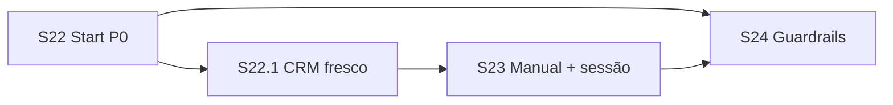

# Plano de sprints — Chatbot Flows S22+ (regras de início / reentrada)

| Campo | Valor |
|-------|-------|
| **Data** | 2026-08-05 |
| **Tipo** | Plano de implementação (continuação) |
| **Base** | [`PLAN_SPRINTS_CHATBOT_FLOWS.md`](./PLAN_SPRINTS_CHATBOT_FLOWS.md) · [`PLAN_SPRINTS_CHATBOT_FLOWS_S15.md`](./PLAN_SPRINTS_CHATBOT_FLOWS_S15.md) (S0–S21 entregues) |
| **Nome** | **Chatbot Flows — Regras de ligar o bot** |
| **Escopo** | Multi-tenant; canal WhatsApp UazAPI (fonte única = `saveMessage` inbound) |
| **Princípio** | 1 sprint = 1 tema; trigger só no nó `start` + runner; **não** iniciar em `outgoing` do painel |
| **Status** | **S22 + S22.1 + S23 + S24** no código |

---

## 1. Contexto e problema

O runtime já está ligado à fonte única correta:

```
webhook UazAPI → saveMessage → inserted && incoming → runChatbotFlowsRuntimeInbound
  → match trigger → sessão → sendKanbanAutomationOutbound*
```

Gatilhos MVP hoje:

| Trigger | Comportamento atual | Limitação |
|---------|---------------------|-----------|
| `keyword` | equals **ou** `includes` (case-insensitive) | Sem modo explícito; sem multi-palavra |
| `first_message` | `COUNT(incoming) <= 1` | Conversa antiga **nunca** inicia de novo |
| (implícito) | Humano `assigned` / `in_progress` pausa | OK (D1) |
| (implícito) | Só incoming insert | Correto — outgoing não deve ligar |

**Dor observada em QA:** conversa já existente + teste pelo painel (`outgoing`) → bot “não responde”. Parte é esperado (outgoing); parte é `first_message` fraco para reativação.

Este plano **não** muda a fonte de mensagens. Evolui **quando** o bot pode criar/reiniciar sessão.

---

## 2. Objetivos

1. Conversas antigas podem reativar o bot com regras claras (idle / keyword).
2. Operador consegue **iniciar flow manualmente** no chat (teste + operação).
3. Grupos e estados de sessão não geram ruído.
4. Keyword previsível (equals vs contains; lista).
5. Nós de fatura/CRM usam sempre o estado **mais atual** da conversa (vínculo mid-flow).
6. (S24) Cooldown, horário, instância e prioridade entre flows.

**Não é objetivo:**

- Ligar bot em mensagem `outgoing` do painel (loop).
- Iniciar a partir de sync de histórico antigo.
- Substituir o simulador do editor (manual no chat é runtime real).

---

## 3. Princípios

1. **Fonte única inbound** — só `runChatbotFlowsRuntimeInbound` (e endpoint explícito de start manual).
2. **Config no nó `start`** — `data.trigger` versionado no grafo publicado (Zod + UI + engine + testes).
3. **Fail-closed** — feature `chatbot_flows_runtime` + flow `active` + published version.
4. **D1 preservado** — humano no comando → não iniciar / pausar.
5. **Logs** — ao skipar start, log estruturado opcional (reason) em debug ou warn amostrado (evitar spam).
6. **Simulador** — refletir novos modos de trigger no dry-run de match.

---

## 4. Visão dos sprints (ordem)

| Sprint | Nome | Objetivo | Depende |
|--------|------|----------|---------|
| **S22** | Start rules P0 | Idle + keyword melhor + só DM + reentrada | S3 runtime |
| **S22.1** | CRM / fatura sempre frescos | Vínculo mid-flow; lookup pelo DB | S22 / S11 invoice |
| **S23** | Start manual + política de sessão | Botão no chat; reset vs ignore; retentar fatura | S22 |
| **S24** | Guardrails + roteamento | Cooldown, horário, instância, prioridade | S22 |

Duração indicativa: **3–5 dias** (S22 + S22.1) · **3–5 dias** (S23) · **4–6 dias** (S24).



Ordem de execução: **S22 → S22.1 → S23 → S24** (S22.1 pode fechar no mesmo PR que S22).

---

## 5. Detalhe por sprint

### S22 — Start rules P0 (idle, keyword, DM, reentrada)

**Meta:** conversa antiga e keyword previsível ligam o bot; grupos não.

#### Entregas

1. **Evoluir `data.trigger` no `start`** (Zod + painel + export/import):

   ```ts
   // Conceito — campos novos opcionais (defaults = comportamento atual)
   type StartTrigger =
     | {
         type: 'keyword';
         value: string;           // "oi" ou "oi|olá|menu"
         match?: 'equals' | 'contains'; // default: contains (compat)
         keywords?: string[];     // opcional; se set, ignora split de value
       }
     | {
         type: 'first_message';
         idle_after_hours?: number | null; // null/0 = só COUNT<=1 (hoje)
       };
   ```

2. **`first_message` + idle**
   - Se `idle_after_hours` ausente/0: manter `incomingMessageCount <= 1`.
   - Se `N > 0`: match se count ≤ 1 **OU** `now - last_customer_message_at` (ou última incoming) ≥ N horas **antes** desta mensagem (usar timestamp da mensagem atual / `last_customer_message_at` com cuidado para não contar a msg corrente).

3. **Keyword**
   - `match: equals` | `contains` (default `contains` para não quebrar published).
   - Multi-valor: split por `|` em `value` **ou** array `keywords`.
   - Trim + lower-case.

4. **Só DM**
   - Flag no start (default **true** no MVP novo; published antigo sem campo = **false** para não mudar comportamento de quem usa grupo) **OU** default true com decisão D22.1.
   - Runner: se `external_chat_id` endsWith `@g.us` → skip start.

5. **Reentrada**
   - Se **não** há sessão em `active|waiting_input|waiting_delay|waiting_http`: permitir match de trigger e criar sessão (já parcialmente assim).
   - Sessões `ended` / `paused` / `error` **não** bloqueiam novo start.
   - Documentar: sessão `active` (sem wait) ainda engole inbound sem avançar — tratar política em **S23**.

6. Testes unitários em `matchFlowTrigger` + 1–2 casos no runner (mock).
7. UI no painel do `start`: campos idle, match mode, keywords, checkbox “Somente conversas 1:1”.

#### Critérios de aceite

- [x] Conversa com histórico antigo + keyword publicada inicia flow no WhatsApp
- [x] `first_message` com idle 24h inicia após 24h sem incoming do cliente
- [x] `first_message` sem idle continua só na 1ª incoming
- [x] Grupo `@g.us` não inicia se “somente 1:1” ativo
- [x] Keyword `equals` não casa substring acidental
- [x] Publish/export/import preservam novos campos; defaults compatíveis
- [x] Feature off / humano assigned → sem start (regressão)

#### Fora de S22

- Botão manual no chat  
- Cooldown / horário / instância / prioridade entre flows  
- Reset de sessão ativa por keyword  

---

### S22.1 — Dados CRM sempre frescos (vínculo mid-flow)

**Meta:** vincular cliente/lead no meio da sessão não deixa o bot “cego”; nós de fatura/contato releem o estado atual da conversa.

**Dor de QA:** flow passou em `lookup_invoice` / `invoice_assist` sem `client_id` → saída `empty`; operador vincula o cliente depois; sem re-lookup, permanece vazio mesmo com fatura `pending` no CRM.

#### Entregas

1. Antes de `lookup_invoice` / `invoice_assist`: **sempre** `resolveClientIdForConversation` (DB) — **nunca** só `variables['client.id']` do seed inicial.
2. Ao resolver cliente: atualizar `client.id` / `client_id` na sessão (`mapped` + merge).
3. Em todo inbound com sessão viva: manter merge de seed CRM (`buildFlowSessionVariableBag`) para refletir vínculo novo.
4. Log estruturado: `client_resolved_at_lookup`, `client_id`, `found`, `invoice_count`.
5. Teste: conversa sem cliente → lookup empty → link → **nova passagem pelo nó** (reentrada keyword / restart) → encontra fatura aberta.  
   Retentar na **mesma** sessão sem reset total = **S23** (ramo/mensagem “tente de novo”).

#### Critérios de aceite

- [x] Vínculo mid-flow **antes** do nó de fatura → encontra fatura aberta
- [x] Seed antigo com `client.id` vazio/errado não prevalece sobre o DB no lookup
- [x] Após vínculo, perfil do chat e bot veem o mesmo `client_id`
- [x] Log de lookup com `client_id` + `invoice_count`

#### Fora de S22.1

- UI “tentar fatura de novo” sem reiniciar flow (S23)  
- Auto-reexecutar nó `empty` ao detectar `client_id` mudou (futuro)

---

### S23 — Start manual + política de sessão

**Meta:** operador inicia/reinicia o bot no chat; keyword pode resetar sessão viva (opcional).

#### Entregas

1. **Start manual**
   - Ação na UI do chat (conversa aberta): “Iniciar flow” → escolhe flow `active` do tenant (ou o publicado default).
   - `POST /api/chatbot-flows/sessions/start` (auth + tenant + permissão chat):
     - body: `{ conversation_id, flow_id? }`
     - valida: feature runtime, conversa do tenant, não grupo (se regra), não humano bloqueando (ou force flag admin).
     - cria sessão + `processInboundStep` com `justStarted` (sem precisar de messageBody de keyword).
   - Mesmo outbound UazAPI do runner.

2. **Política com sessão viva** (config no `start` ou no flow header):

   | Política | Comportamento |
   |----------|----------------|
   | `ignore_if_session_alive` (default) | Keyword/idle não reinicia; sessão `active` sem wait continua ignorando texto |
   | `restart_on_keyword` | Keyword match → encerra sessão atual (`ended`) e cria nova |

3. Logs: `chatbot_flows_runtime` com `reason: manual | keyword | first_message | restart`.
4. Testes API + UI mínima (botão disabled se feature off / humano in_progress sem force).

#### Critérios de aceite

- [x] Botão inicia flow e envia 1ª mensagem do grafo no WhatsApp
- [x] Manual não usa `outgoing` do painel como “trigger mágico” — endpoint dedicado
- [x] Com `restart_on_keyword`, mandar keyword no meio do flow reinicia do `start`
- [x] Default não reinicia sessão em `waiting_input` sem keyword restart
- [x] Humano `in_progress` bloqueia manual (exceto permissão explícita se D22.3)

#### Fora de S23

- Cooldown / horário / multi-instância  

---

### S24 — Guardrails e roteamento entre flows

**Meta:** evitar spam de reinício e competição entre vários flows publicados.

#### Entregas

1. **Cooldown** (`start` ou flow): não criar nova sessão na mesma conversa+flow em menos de X minutos (após `ended`/`error`).
2. **Janela horária** (opcional): timezone do tenant; fora da janela → skip (log reason).
3. **Bind de instância**: flow só na `chat_instance_id` (lista); vazio = todas do tenant.
4. **Prioridade / D2**
   - Keyword única por tenant no publish (validação) **ou**
   - Campo `priority` numérico; runner ordena e pega o primeiro match.
5. Documentar matrix de skip reasons para suporte.
6. Testes de prioridade e cooldown.

#### Critérios de aceite

- [x] Dois flows com keywords distintas: cada um só no seu match
- [x] Dois flows com overlap: prioridade + warn no publish (D24.1; não bloqueia)
- [x] Cooldown impede double-start em rajada
- [x] Flow bound à instância A não roda na B
- [x] Fora do horário: sem sessão nova; sessão viva `waiting_input` ainda responde (só start gated)

#### Skip reasons (suporte)

| `reason` | Quando |
|----------|--------|
| `feature_off` | Flag `chatbot_flows_runtime` off |
| `human_busy` | Conversação com humano assigned / in_progress |
| `dm_only_group` | `dm_only` e conversa é grupo |
| `instance_mismatch` | Instância da conversa fora de `instance_ids` |
| `outside_schedule` | Fora de `schedule_start`–`schedule_end` (tz tenant) |
| `cooldown` | Nova sessão antes de `cooldown_minutes` após ended/error/paused |
| `no_trigger_match` | Nenhum flow passou gates + trigger |
| `session_alive_ignore` | Sessão ativa e política `ignore_if_session_alive` |
| `flow_not_found` | Manual start com flow inválido |

Log: `event=chatbot_flows_runtime` · `phase=start_skipped`.

#### Fora de S24

- Gatilho por tag/coluna kanban → **S27**
- Opt-out global `parar`/`sair` → **S27**
- Classificar/converter cliente·lead → **S26** ([`PLAN_SPRINTS_CHATBOT_FLOWS_S26.md`](./PLAN_SPRINTS_CHATBOT_FLOWS_S26.md))

---

## 6. Decisões de produto (fechar no início de cada sprint)

| ID | Tema | Opções | Sugestão |
|----|------|--------|----------|
| **D22.1** | Default “só DM” | true para novos / false para published legado | Novos `true`; ausente no JSON = `false` (compat) |
| **D22.2** | Default keyword match | `contains` (hoje) / `equals` | Manter `contains` como default |
| **D22.3** | Manual com humano ativo | Bloquear / permitir admin | Bloquear; force só `tenant_admin` |
| **D22.4** | Idle usa qual clock | `last_customer_message_at` / última incoming | Preferir última incoming `direction=incoming` (excluindo a msg corrente) |
| **D22.5** | Lookup empty sem cliente | Só `empty_message` / sugerir vincular + keyword | Sugerir vincular + retentar (copy no `empty_message`; ramo retentar em S23) |
| **D23.1** | Restart keyword | Off default / on | Off default (`ignore_if_session_alive`) |
| **D24.1** | Keywords duplicadas | Bloquear publish / prioridade | Prioridade + warn no publish |
| **D24.2** | Cooldown default | 0 (off) / 30 min | 0 off; UI sugere 30 |

---

## 7. Arquivos / pontos de toque (orientação)

| Área | Onde |
|------|------|
| Match puro | `flowRuntimeEngine.ts` (`matchFlowTrigger`) + espelho FE `runtimeEngine.ts` |
| Runner | `chatbotFlowsRuntimeRunner.ts` |
| Guards S24 | `flowStartGuards.ts` (cooldown, horário, instância, prioridade) |
| Hook inbound | `chatController.saveMessage` (já chama runner; S23 só endpoint novo) |
| Schema UI | `nodeCatalog.ts` / `graphValidation.ts` + `NodePropertiesPanel.tsx` |
| Feature | `chatbot_flows_runtime` (sem nova flag obrigatória; opcional `chatbot_flows_manual_start`) |
| Testes | `flowRuntimeEngine.test.ts` · `flowStartTrigger.test.ts` · `flowStartGuards.test.ts` |

---

## 8. Relação com planos anteriores

| Documento | Papel |
|-----------|--------|
| `PLAN_SPRINTS_CHATBOT_FLOWS.md` | Fundação S0–S14; triggers MVP citados |
| `PLAN_SPRINTS_CHATBOT_FLOWS_S15.md` | S15–S21 entregues |
| **Este arquivo** | S22–S24 regras de início / reentrada |

Triggers já previstos no plano base (“manual · keyword · first_message”) materializam-se aqui.

---

## 9. Definition of Done (fase S22–S24)

- [x] QA consegue ligar bot em conversa antiga via keyword e via idle
- [x] Vínculo mid-flow + re-lookup encontra fatura aberta
- [x] Operador inicia flow pelo chat sem mandar mensagem pelo painel como truque
- [x] Grupos não disparam flows com “só 1:1”
- [x] Sem regressão: feature off, humano assigned, outbound UazAPI
- [x] Doc de suporte: tabela de reasons de skip
- [x] Aceite marcado neste arquivo (S22–S24)

---

## 10. Próximo passo operacional

1. ~~S22 + S22.1 + S23 + S24~~ entregues.  
2. ~~Fase tickets S25–S25.2~~ — [`PLAN_SPRINTS_CHATBOT_FLOWS_S25.md`](./PLAN_SPRINTS_CHATBOT_FLOWS_S25.md) · [`SUPPORT_TICKET_FLOW.md`](./SUPPORT_TICKET_FLOW.md).  
3. **S26 vínculo CRM:** [`PLAN_SPRINTS_CHATBOT_FLOWS_S26.md`](./PLAN_SPRINTS_CHATBOT_FLOWS_S26.md).  
4. Candidatos **S27**: gatilho tag/kanban; opt-out `parar`/`sair`.
