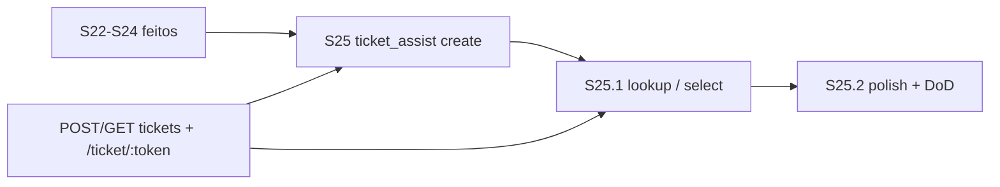
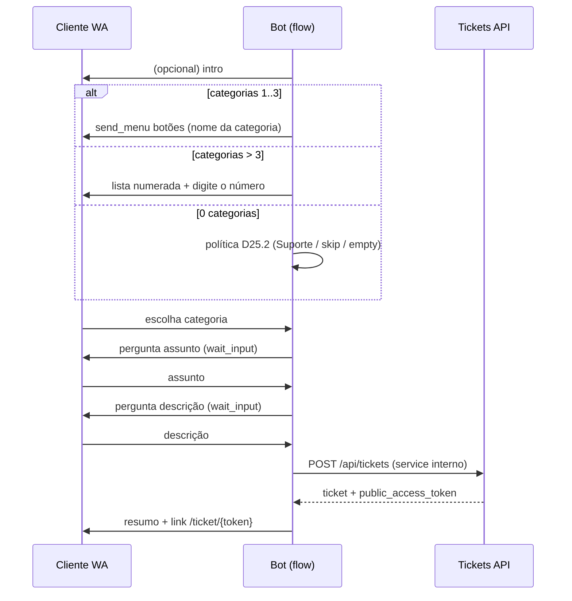

# Plano de sprints — Chatbot Flows S25 (tickets de suporte)

| Campo | Valor |
|-------|-------|
| **Data** | 2026-08-05 |
| **Tipo** | Plano de implementação (continuação) |
| **Base** | [`PLAN_SPRINTS_CHATBOT_FLOWS.md`](./PLAN_SPRINTS_CHATBOT_FLOWS.md) · [`PLAN_SPRINTS_CHATBOT_FLOWS_S22.md`](./PLAN_SPRINTS_CHATBOT_FLOWS_S22.md) (S0–S24) |
| **Nome** | **Chatbot Flows — Abrir e consultar ticket pelo WhatsApp** |
| **Escopo** | Multi-tenant; canal WhatsApp UazAPI; tickets **CRM/tenant** (não platform support SuperAdmin) |
| **Princípio** | 1 sprint = 1 tema; nós compostos no estilo `invoice_assist`; **reusar** APIs/tickets existentes + link público já implantado |
| **Status** | **S25 · S25.1 · S25.2** no código (fase tickets fechada) |

---

## 1. Contexto e problema

Hoje o operador abre ticket pelo chat com `ChatCreateTicketDialog` (humano). O runtime de flows já consulta/envia **fatura** (`invoice_assist`), mas **não há nós de ticket**.

O produto precisa que o **cliente no WhatsApp**:

1. **Abra um chamado** sozinho: categoria → assunto → descrição → ticket criado → resumo + **link único**.
2. **Consulte chamados** existentes: lista → escolhe → recebe o **link único**.

### O que o sistema já tem (reusar)

| Capacidade | Onde |
|------------|------|
| Criar ticket (auth) | `POST /api/tickets` — `ticketsController` · Zod: subject, description, contact_*, category_id?, client_id?, channel, … |
| Categorias do tenant | `GET /api/ticket-categories` — `ticket_categories` (UUID + `name`) |
| Listar por cliente | `GET /api/tickets?client_id=` |
| Token + URL pública | Coluna `tickets.public_access_token`; rota FE **`/ticket/:token`** → `PublicTicketView`; API `GET /api/public/tickets/:token` |
| Padrão pós-criação no chat | `Chat.tsx` já monta `${origin}/ticket/${token}` e pode enviar no WhatsApp |
| Padrão de nó composto | `invoice_assist` + `flowInvoiceActions` + handles `default` / `empty` / `invalid` |

**Conclusão:** o “link único para visualizar ticket” **já está implantado**. S25 não reinventa portal; só **grava variáveis** (`ticket.public_url`) e envia no flow. Polimento opcional (copy, UX mobile do `PublicTicketView`) fica como aceite secundário.

### Gaps

- Nenhum tipo de nó `ticket_*` no catálogo / engine / runner.
- Create no bot precisa resolver **contato** (nome/email/telefone) a partir da conversa + `client_id` fresco (S22.1).
- `conversation_id` não é coluna de `tickets` — hoje vai em `custom_fields` (como o dialog do chat).
- Categoria: se 0 categorias, política (criar “Suporte”, skip, ou fail com mensagem).
- Menu WhatsApp: botões nativos limitados (~3); se mais categorias/tickets → lista numerada (texto), igual regra pedida.

---

## 2. Objetivos

1. Nó **automático** `ticket_assist` (criar chamado) no estilo fatura.
2. Nó(s) de **busca/consulta**: `lookup_ticket` + composto `ticket_lookup_assist` (lista → escolha → link).
3. Variáveis de sessão estáveis para templates (`{{ticket.number}}`, `{{ticket.public_url}}`, …).
4. Runtime fail-closed: sem cliente vinculado → mensagem clara (vincular / empty), sem inventar ticket órfão se política exigir cliente.
5. Documentação de suporte + testes unitários do match/menu/categoria.

**Não é objetivo**

- Platform support (`/suporte` SuperAdmin).
- Substituir o dialog humano no chat (continua existindo).
- Gatilho por tag/kanban ou opt-out `parar` (candidatos **S26**, fora deste plano).
- Novo schema de ticket / novo portal paralelo ao `/ticket/:token`.

---

## 3. Princípios

1. **Espelhar invoice** — átomos + composto; I/O no runner; engine puro despacha/resume.
2. **Fonte única inbound** — mesmo `runChatbotFlowsRuntimeInbound`.
3. **Cliente fresco** — `resolveClientIdForConversation` em todo lookup/create (não só seed).
4. **Link canônico** — `FRONTEND_URL` (ou origin em FE) + `/ticket/{public_access_token}`.
5. **Channel** create = `whatsapp`; `custom_fields`: `{ source: 'chatbot_flow', conversation_id, flow_id, session_id }`.
6. **≤3 opções → botões**; **>3 → digitar número** (texto). Aplicar a categorias e a lista de tickets.
7. **Fail-closed** — feature `chatbot_flows_runtime`; validação Zod no publish.

---

## 4. Visão dos sprints

| Sprint | Nome | Objetivo | Depende |
|--------|------|----------|---------|
| **S25** | Abrir ticket (assist) | Nó composto criar chamado + vars + link | S11 invoice pattern · tickets API |
| **S25.1** | Consultar ticket | Lookup/lista/escolha + link | S25 (shared `flowTicketActions`) |
| **S25.2** | Polimento + DoD | Simulador, copy, edge cases, doc suporte | S25 + S25.1 |



Ordem: **S25 → S25.1 → S25.2**. Duração indicativa: **4–6 dias** (S25) · **3–5 dias** (S25.1) · **2–3 dias** (S25.2).

---

## 5. Detalhe por sprint

### S25 — `ticket_assist` (abrir chamado)

**Meta:** um nó na paleta CRM que conduz o cliente até o ticket aberto e envia o link público.

#### UX conversacional (automática)



#### Entregas

1. **Tipos de nó**
   - `ticket_assist` (paleta) — composto create.
   - Opcional átomo interno (não precisa na paleta no MVP): steps embutidos no engine como `invoice_assist`.
2. **`flowTicketActions.ts` (BE)**
   - `listTicketCategoriesForTenant`
   - `runtimeCreateTicket` (wrapper service: mesma regra do controller, sem HTTP do usuário final)
   - `buildTicketPublicUrl(token)`
   - `buildCategoryMenu` / escolha por índice ou `interactiveReplyId`
3. **Schema `ticket_assist` (Zod FE+BE)** — sugerido:

| Campo | Default | Notas |
|-------|---------|-------|
| `intro_message` | `''` | Opcional antes da categoria |
| `category_prompt` | texto | Prefácio do menu |
| `subject_prompt` | `Qual o assunto do chamado?` | |
| `description_prompt` | `Descreva o problema com detalhes:` | |
| `success_template` | ver abaixo | Usa vars `ticket.*` |
| `empty_client_message` | vincular cliente | Sem `client_id` |
| `empty_categories_message` | | 0 categorias (se D25.2 = fail) |
| `invalid_message` | opção inválida | |
| `max_invalid` | `3` | |
| `priority` | `normal` | Fixo no nó ou omitir |
| `require_client` | `true` | D25.1 |

**`success_template` sugerido:**

```text
Chamado aberto com sucesso!
Número: {{ticket.number}}
Assunto: {{ticket.subject}}
Acompanhe aqui: {{ticket.public_url}}
```

4. **Handles**

| Handle | Quando |
|--------|--------|
| `default` | Ticket criado + mensagem de sucesso enviada |
| `empty` | Sem cliente (se require) / sem categorias (política fail) / create falhou soft |
| `invalid` | Estourou `max_invalid` em categoria |

5. **Variáveis** (após create)

| Key | Origem |
|-----|--------|
| `ticket.id` | UUID |
| `ticket.number` | `ticket_number` |
| `ticket.subject` | |
| `ticket.status` | |
| `ticket.category_id` / `ticket.category_name` | |
| `ticket.public_token` | `public_access_token` |
| `ticket.public_url` | `{FRONTEND_URL}/ticket/{token}` |
| aliases flat | `ticket_id`, `ticket_number`, `ticket_public_url`, … |
| sessão | `ticket._categories`, `ticket._assist_step`, `ticket._assist_retries` |

6. **UI** — `NodePropertiesPanel` + `FlowCanvasNode` (triple handles) + paleta CRM.
7. **Testes** — escolha categoria ≤3 vs >3; create com client; empty sem client.

#### Critérios de aceite

- [x] Com 2–3 categorias: cliente vê **botões** e ao tocar avança.
- [x] Com 5+ categorias: lista numerada; digitar `2` seleciona a 2ª.
- [x] Assunto + descrição coletados; ticket aparece no painel com `channel=whatsapp` e `client_id` da conversa.
- [x] Mensagem final contém URL `/ticket/{token}` abrível sem login (`PublicTicketView`).
- [x] Sem cliente vinculado + `require_client`: handle `empty` + mensagem configurável (não cria ticket fantasma).
- [x] Publish valida schema; simulador dry-run do caminho feliz (mock create).

#### Fora de S25

- Consulta/lista de tickets existentes → **S25.1**
- Anexos / prioridade escolhida pelo cliente
- Atribuir agente automaticamente além do `default_team_id` da categoria

---

### S25.1 — Consultar ticket (`lookup_ticket` + `ticket_lookup_assist`)

**Meta:** cliente lista chamados (abertos ou filtráveis), escolhe e recebe o link único.

#### Entregas

1. **Átomos** (compat / composição avançada)
   - `lookup_ticket` — busca no DB; handles `default` | `empty`
   - `select_ticket` — interpreta `answer` / botão; handles `default` | `invalid`
2. **Composto paleta** `ticket_lookup_assist`
   - Espelho de `invoice_assist` (`open_menu` / `last_open`)
3. **`runtimeLookupTicket`**
   - Filtro default: status abertos (`new`, `open`, `pending`, `waiting_customer`, `in_progress`) — **D25.3**
   - Ordenação: `updated_at DESC`
   - `limit` 1–20 (default 8)
   - Catálogo sessão `ticket._items` (id, number, subject, status, public_url)
4. **Menu**
   - ≤3 itens → `send_menu` botões (label curta: `#123 Assunto…`)
   - >3 → texto numerado + `wait_input`
5. **Sucesso** — `detail_template` / `link_template` com `{{ticket.public_url}}` (se token ausente, regenerar ou empty — **D25.4**)

#### Critérios de aceite

- [x] Cliente com 1 ticket aberto + `last_open`: recebe link direto.
- [x] Cliente com vários: lista → escolha → link correto daquele ticket.
- [x] Sem tickets no filtro: `empty_message` + handle `empty`.
- [x] Ticket de outro cliente nunca vaza (sempre `client_id` da conversa + tenant).

#### Fora de S25.1

- Busca por número digitado sem listar (pode ser S25.2 ou S26)
- Mensagens internas do ticket no WhatsApp (só link para o portal)

---

### S25.2 — Polimento, simulador e DoD

1. ~~Simulador FE: mock create + mock lista (como fatura).~~
2. ~~Catálogo de variáveis no editor (`ticket.*` em templateVariables + flowDefined).~~
3. ~~Docs suporte: [`SUPPORT_TICKET_FLOW.md`](./SUPPORT_TICKET_FLOW.md) (reasons + QA).~~
4. ~~QA checklist WhatsApp real + link `/ticket/:token` (no doc suporte).~~
5. ~~Regenerar `public_access_token` se null em ticket legado (lookup).~~
6. ~~Ponteiros atualizados nos planos S15/S22/base.~~

#### Critérios de aceite

- [x] Simulador dry-run create + lookup (kind `ticket`, labels por fase).
- [x] Picker de variáveis lista `ticket.public_url`, `ticket.number`, etc.
- [x] Doc de reasons + checklist QA publicado.
- [x] Lookup regenera token ausente (D25.4).
- [x] Planos base apontam S25 concluída / S26 candidatos.

---

## 6. Decisões de produto

| ID | Tema | Opções | Sugestão |
|----|------|--------|----------|
| **D25.1** | Create sem cliente | Bloquear / criar só com telefone+nome | **Bloquear** (`require_client=true`); empty pede vínculo |
| **D25.2** | 0 categorias | Auto “Suporte” / empty / criar ticket sem category | **Empty** + mensagem; ops cadastra categorias (ou botão no empty para humano) |
| **D25.3** | Status no lookup | Só abertos / todos / configurável | **Só abertos** no default; flag `include_closed` no nó depois |
| **D25.4** | Token ausente | Regenerar / empty | **Regenerar** no service de lookup (mesmo padrão do Chat.tsx) |
| **D25.5** | Email obrigatório na API | Sintético `{phone}@whatsapp.local` / e-mail do client | **E-mail do client** se houver; senão sintético estável (igual chat) |
| **D25.6** | Limite botões WA | 3 fixo / configurável | **3** (WhatsApp/UazAPI prático); acima = número |
| **D25.7** | Nome do nó na paleta | “Abrir chamado” / “Ticket assist” | **Abrir chamado** + **Consultar chamado** |

---

## 7. Arquivos / pontos de toque

| Área | Onde |
|------|------|
| Actions | `packages/backend/src/services/chatbotFlows/flowTicketActions.ts` (**novo**) |
| Vars FE | `src/features/chatbot-flows/lib/flowTicketVars.ts` (**novo**) |
| Engine BE/FE | `flowRuntimeEngine.ts` / `runtimeEngine.ts` |
| Runner | `chatbotFlowsRuntimeRunner.ts` (actions `lookup_ticket`, `create_ticket`, menus) |
| Schema | `graphValidation.ts` · `nodeCatalog.ts` |
| UI | `NodePropertiesPanel` · `FlowCanvasNode` · `nodeCategories` · `nodeVisuals` |
| Tickets domain | `ticketsController` / service interno extrair create reutilizável; `ticketCategoriesController` |
| Link público | `PublicTicketView` · `GET /api/public/tickets/:token` (já existe) |
| Referência chat | `ChatCreateTicketDialog.tsx` · trecho URL em `Chat.tsx` |
| Testes | `flowTicketActions.test.ts` · engine cases |
| Feature | reusa `chatbot_flows_runtime` (sem flag nova obrigatória) |

---

## 8. Relação com planos anteriores

| Documento | Papel |
|-----------|--------|
| `PLAN_SPRINTS_CHATBOT_FLOWS.md` | Fundação; CRM/HTTP |
| `PLAN_SPRINTS_CHATBOT_FLOWS_S15.md` | S15–S21 |
| `PLAN_SPRINTS_CHATBOT_FLOWS_S22.md` | Start rules; citava S25 genérico (tag/opt-out) |
| **Este arquivo** | S25 tickets (create + lookup); tag/opt-out → **S26** |

Padrão de implementação = **S11 / S11.1 invoice**, não reinventar runtime.

---

## 9. Definition of Done (fase S25)

- [x] Cliente WA abre chamado ponta a ponta e recebe link `/ticket/{token}` funcional *(código + checklist QA)*
- [x] Cliente WA lista e escolhe ticket existente e recebe o link correto *(código + checklist QA)*
- [x] Ticket criado aparece no módulo Tickets do tenant com cliente/categoria corretos *(código)*
- [x] Sem regressão invoice_assist / start rules S22–S24 *(padrão reutilizado; sem mudança nesses paths)*
- [x] Simulador cobre create + lookup (mock)
- [x] Aceite marcado neste arquivo
- [x] Ponteiros atualizados nos planos base

---

## 10. Próximo passo operacional

1. ~~S25 `ticket_assist` (abrir chamado)~~  
2. ~~S25.1 consultar / listar ticket + link~~  
3. ~~S25.2 polish + DoD~~ — ver [`SUPPORT_TICKET_FLOW.md`](./SUPPORT_TICKET_FLOW.md).  
4. **S26 vínculo CRM:** [`PLAN_SPRINTS_CHATBOT_FLOWS_S26.md`](./PLAN_SPRINTS_CHATBOT_FLOWS_S26.md) (classificar + converter).  
5. Candidatos **S27**: gatilho tag/kanban; opt-out `parar`/`sair`.
