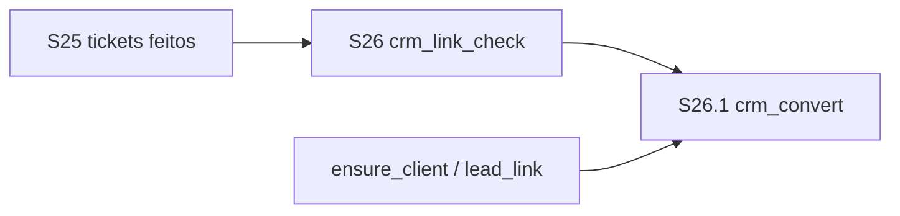
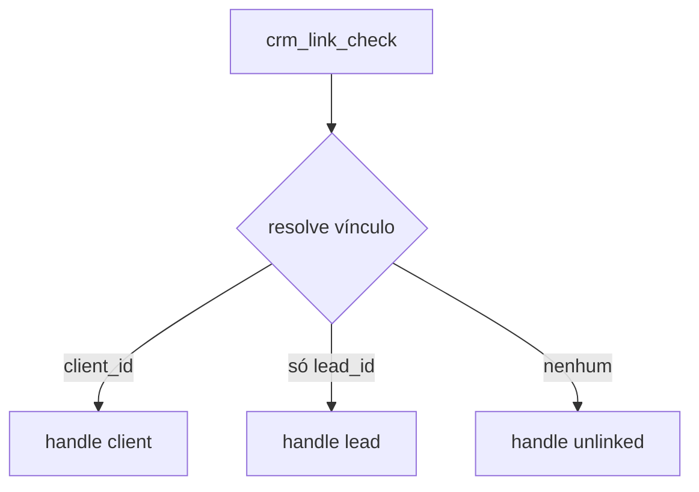

# Plano de sprints — Chatbot Flows S26 (vínculo CRM: cliente / lead)

| Campo | Valor |
|-------|-------|
| **Data** | 2026-08-05 |
| **Tipo** | Plano de implementação (continuação) |
| **Base** | [`PLAN_SPRINTS_CHATBOT_FLOWS.md`](./PLAN_SPRINTS_CHATBOT_FLOWS.md) · [`PLAN_SPRINTS_CHATBOT_FLOWS_S25.md`](./PLAN_SPRINTS_CHATBOT_FLOWS_S25.md) |
| **Nome** | **Chatbot Flows — Classificar e converter vínculo CRM** |
| **Escopo** | Multi-tenant; canal WhatsApp UazAPI; `chat_conversations.client_id` / `lead_id` |
| **Princípio** | 1 sprint = 1 tema; handles tipados (não inventar condition genérica); **reusar** lógica Kanban `ensure_client` / lead create-or-link |
| **Status** | S26 + S26.1 implementados |

---

## 1. Contexto e problema

Flows de ticket/fatura exigem **cliente vinculado**. Hoje o bot não consegue:

1. **Ramificar** o fluxo conforme o contato já é cliente, já é lead, ou não tem vínculo.
2. **Criar/vincular** lead ou cliente a partir da conversa (telefone/nome) sem o operador fazer isso no chat.

O CRM já faz isso em automações de coluna Kanban (`kanbanColumnAutomationService`: create/link lead, ensure client). S26 traz o mesmo poder para o editor de flows.

### O que o sistema já tem (reusar)

| Capacidade | Onde |
|------------|------|
| `client_id` / `lead_id` na conversa | `chat_conversations` |
| Seed de vars `client.id` | `flowVariableContext` (S22.1 fresco) |
| Match telefone → cliente | `resolveClientIdForConversation` / Kanban ensure_client |
| Criar/vincular lead | Kanban `lead_create_or_link` |
| Converter lead → cliente / ensure client | Kanban `ensure_client` |
| Handles tipados no canvas | `invoice_assist` / `ticket_assist` (default / empty / invalid) |

### Gaps

- Nenhum nó de **classificação** de vínculo.
- Nenhum nó de **conversão** lead/cliente no runtime de flows.
- Vars `lead.id` / `lead.name` ainda fracos ou ausentes no seed.

---

## 2. Objetivos

1. **S26** — nó composto (paleta) que classifica o vínculo e sai por 3 handles.
2. **S26.1** — nó(s) que convertem/garantem lead ou cliente e gravam vars + atualizam a conversa.

**Não é objetivo (→ S27+)**

- Gatilho por tag / coluna Kanban.
- Opt-out global `parar` / `sair`.
- UI de merge de duplicatas de telefone (só fail-closed com reason claro).

---

## 3. Princípios

1. **Prioridade de classificação** — se houver `client_id` → **cliente** (mesmo que exista `lead_id` residual). Senão se houver `lead_id` → **lead**. Senão → **não vinculado**.
2. **Cliente fresco** — sempre re-ler conversa (+ match telefone opcional, D26.2) no momento do nó, não confiar só no seed inicial.
3. **Fail-closed** — conversão sem telefone/nome mínimo → handle `error` / `empty` + mensagem configurável.
4. **Extrair service compartilhado** — preferir funções puras/serviço em `chatbotFlows/flowCrmLinkActions.ts` espelhando Kanban, sem acoplar o runner ao service gigante do Kanban se possível (ou wrapper fino).
5. **Paleta CRM** — nomes em PT: **“Vínculo CRM”** + **“Converter CRM”**.

---

## 4. Visão dos sprints

| Sprint | Nome | Objetivo | Depende |
|--------|------|----------|---------|
| **S26** | Classificar vínculo | Nó 3 saídas: cliente / lead / não vinculado | S22.1 client fresco |
| **S26.1** | Converter vínculo | Converter → lead · Converter → cliente | S26 (shared actions) |



Ordem: **S26 → S26.1**. Duração indicativa: **2–4 dias** (S26) · **3–5 dias** (S26.1).

---

## 5. Detalhe por sprint

### S26 — Classificar vínculo (`crm_link_check`)

**Meta:** um nó na paleta CRM com **3 saídas** tipadas.

#### Comportamento



1. Action `resolve_crm_link` no runner.
2. Lê conversa (tenant-scoped): `client_id`, `lead_id`, telefone.
3. Opcional D26.2: se sem `client_id`, tenta match por telefone e **atualiza** `client_id` na conversa (mesmo espírito S22.1) antes de classificar.
4. Grava vars: `crm.link_kind` = `client` \| `lead` \| `unlinked`; `client.id` / `lead.id` quando houver.
5. Engine segue o handle correspondente (`client` / `lead` / `unlinked`).

#### Schema (sugerido)

```ts
{
  label?: string
  /** Se true, tenta match telefone→cliente antes de classificar */
  refresh_client_match?: boolean // default true
}
```

Handles obrigatórios no publish: `client`, `lead`, `unlinked`.

#### Critérios de aceite

- [x] Conversa com `client_id` → sempre saída **cliente** (mesmo com lead residual).
- [x] Só `lead_id` → saída **lead**; vars `lead.id` preenchidas.
- [x] Sem vínculo → saída **não vinculado**.
- [x] Publish valida 3 handles; simulador permite forçar cada ramo (ou usa sujeito Testar).
- [x] Não altera lead/cliente no CRM (só classificação + match opcional de cliente).

#### Fora de S26

- Criar lead/cliente → **S26.1**
- Opt-out / tag trigger → **S27**

---

### S26.1 — Converter vínculo (`crm_convert`)

**Meta:** nó composto (ou 1 nó com modo) que **garante** lead ou cliente na conversa.

#### Modos

| Modo | Efeito | Handles |
|------|--------|---------|
| `to_lead` | Se já cliente → `already_client` (ou skip ok). Se já lead → ok (idempotente). Senão cria/vincula lead e seta `lead_id`. | `default` / `error` (+ opcional `already_client`) |
| `to_client` | Se já cliente → ok. Se lead → converte/ensure client e limpa/bloqueia lead conforme regra Kanban. Se unlinked → cria cliente por telefone/nome. | `default` / `error` |

#### Políticas (D26.x)

- Dedupe telefone ambígua → **error** (mensagem clara), igual Kanban.
- Sem telefone e sem e-mail → **error** (`insufficient_identity`).
- Já é cliente e modo `to_lead` → **não** criar lead (D26.3: handle `already_client` ou seguir `default` sem mudar).

#### Vars após sucesso

- `client.id`, `client_id`, `client.name` (se to_client)
- `lead.id`, `lead_id`, `lead.name` (se to_lead)
- `crm.link_kind` atualizado
- `crm.convert_mode`, `crm.convert_result` (`created` \| `linked` \| `unchanged`)

#### Critérios de aceite

- [x] Unlinked + `to_lead` → lead criado/vinculado; conversa com `lead_id`.
- [x] Unlinked/lead + `to_client` → cliente criado/vinculado; conversa com `client_id`.
- [x] Já cliente + `to_client` → idempotente, saída ok.
- [x] Já cliente + `to_lead` → não cria lead fantasma.
- [x] Sem identidade mínima → error + mensagem.
- [x] Simulador dry-run com mock (e opção “usar vínculo do sujeito Testar”).

---

## 6. Decisões de produto

| ID | Tema | Opções | Sugestão |
|----|------|--------|----------|
| **D26.1** | Prioridade client vs lead | Client first / lead first | **Client first** |
| **D26.2** | Match telefone no check | Só colunas / também match | **Também match** (default on) |
| **D26.3** | to_lead com cliente | Error / handle already_client / noop default | **Handle `already_client`** |
| **D26.4** | Nome na paleta | Técnico / PT | **Vínculo CRM** + **Converter CRM** |
| **D26.5** | Extrair de Kanban | Import direto / copiar service | **Service novo** `flowCrmLinkActions` + testes; Kanban continua dono da UI de coluna |

---

## 7. Arquivos / pontos de toque

| Área | Onde |
|------|------|
| Actions | `packages/backend/.../flowCrmLinkActions.ts` (**novo**) |
| Engine BE/FE | `flowRuntimeEngine.ts` / `runtimeEngine.ts` |
| Runner | `chatbotFlowsRuntimeRunner.ts` |
| Schema | `graphValidation.ts` · `nodeCatalog.ts` |
| UI | `NodePropertiesPanel` · `FlowCanvasNode` · `nodeCategories` · `nodeVisuals` |
| Vars | `flowVariableContext` · `templateVariables/catalog` (`lead.*`, `crm.*`) |
| Referência | `kanbanColumnAutomationService` (lead / ensure_client) |
| Testes | `flowCrmLinkActions.test.ts` |
| Docs | este arquivo + checklist em suporte |

---

## 8. Relação com planos anteriores

| Documento | Papel |
|-----------|--------|
| S22 | Start rules; client fresco |
| S25 | Tickets (depende de cliente) |
| **Este** | Classificar + converter vínculo |
| S27 (candidatos) | Gatilho tag/kanban; opt-out `parar`/`sair` |

---

## 9. Definition of Done (fase S26)

- [x] Nó classificador com 3 saídas funciona no WA real *(S26 — `crm_link_check` + runner)*
- [x] Conversão lead/cliente idempotente e fail-closed *(S26.1 — `crm_convert`)*
- [x] Vars `client.*` / `lead.*` / `crm.*` no picker
- [x] Simulador cobre os 3 ramos + convert mock
- [x] Sem regressão ticket/invoice/start rules *(classificação/conversão isoladas)*
- [x] Aceite S26/S26.1 marcado neste arquivo
- [x] Ponteiros atualizados no plano base

---

## 10. Próximo passo operacional

1. ~~Implementar **S26** (`crm_link_check`)~~ **feito**.  
2. ~~Implementar **S26.1** (`crm_convert`)~~ **feito**.  
3. Candidatos **S27**: tag/kanban trigger; opt-out global.
