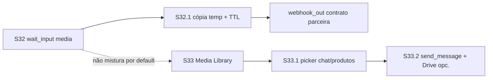

# Plano de sprints — Chatbot Flows S32+ (Mídia inbound + Media Library)

| Campo | Valor |
|-------|-------|
| **Data** | 2026-08-07 |
| **Tipo** | Plano de implementação (continuação) |
| **Base** | [`PLAN_SPRINTS_CHATBOT_FLOWS.md`](./PLAN_SPRINTS_CHATBOT_FLOWS.md) · [`PLAN_SPRINTS_CHATBOT_FLOWS_S31.md`](./PLAN_SPRINTS_CHATBOT_FLOWS_S31.md) · [`MEDIA_CONTRACT_V1.md`](../MEDIA_CONTRACT_V1.md) · [`PLANO_GOOGLE_DRIVE_INTEGRACAO_ARQUIVOS.md`](../PLANO_GOOGLE_DRIVE_INTEGRACAO_ARQUIVOS.md) |
| **Nome** | **S32+ — Mídia inbound no flow + Media Library (outbound/produtos)** |
| **Escopo** | Capturar PDF/mídia no `wait_input` → variáveis estáveis → `webhook_out` no contrato da parceira; biblioteca tenant para produtos/composer (sem URL manual) |
| **Princípio** | Inbound do bot ≠ library permanente; URL UazAPI **não** é contrato estável; Drive = espelho opcional |
| **Status** | **S32 · S32.1 · S33 · S33.1 · S33.2 feitos** (épico mídia inbound + library) |
| **Próximo** | — (S32+ completo; Drive sync opt-in adiado — ver aceite S33.2) |

---

## 1. Meta

Permitir que um flow peça um ficheiro (ex.: extrato PDF), grave URL/nome/tipo em variáveis de sessão e envie à parceira via `webhook_out` com JSON no formato acordado — **sem** depender do link efémero UazAPI/CDN WhatsApp como storage permanente.

Em paralelo (fases seguintes), expor uma **Media Library** por tenant para mídias de produtos/itens e picker no chat (e opcionalmente no nó `send_message`), reutilizando `media_assets` / `MEDIA_STORAGE_ROOT` / URLs assinadas.

---

## 2. Diagnóstico — como está hoje

| Peça | Comportamento atual | Gap |
|------|---------------------|-----|
| **Documento inbound** | Fica em `chat_messages.media` com URL tipicamente UazAPI / `fileURL` | URL efémera; 403 em CDN WhatsApp é comum; não é contrato para parceira |
| **`wait_input`** | Grava só `messageBody` (texto) em `session.variables` | **Não** passa `media_url` / `file_url` / `media_id` / nome / MIME |
| **`webhook_out`** | Interpola variáveis (`envelope` / `envelope_plus` / `custom` — S8) | Sem URL na variável → impossível montar `{ arquivo: { url, nome, tipo } }` |
| **Mídia interna** | `MEDIA_STORAGE_ROOT`, `/api/media/v1/raw?k=&s=`, `media_assets`, catálogo | Existe infra; **não** ligada ao path inbound do flow |
| **Google Drive** | Por cliente (`client_google_drive_files`); plano em [`PLANO_GOOGLE_DRIVE_INTEGRACAO_ARQUIVOS.md`](../PLANO_GOOGLE_DRIVE_INTEGRACAO_ARQUIVOS.md) | Espelho/opcional — **não** substitui storage do picker nem inbound do bot |
| **Docs chatbot** | S31 feito; S30 skip | Próximo tema de produto = este plano |

**Conclusão:** o canal já recebe o PDF na mensagem; o runtime do flow **descarta** a mídia ao preencher variáveis. O webhook custom (S8) já basta **depois** de existir variável com URL confiável.

---

## 3. Contrato JSON (parceira) — exemplo alvo

Quando o lead envia PDF no fluxo, o `webhook_out` (modo `custom`) deve poder produzir:

```json
{
  "cpf": "42362903400",
  "arquivo": {
    "nome": "extrato_inss.pdf",
    "tipo": "application/pdf",
    "url": "https://…/extrato_inss.pdf"
  }
}
```

### Variáveis de sessão sugeridas (S32)

| Variável | Origem | Notas |
|----------|--------|-------|
| `{{cpf}}` (ou nome do `save_as` do passo CPF) | texto `wait_input` | Já funciona hoje |
| `{{arquivo.url}}` / `{{arquivo.nome}}` / `{{arquivo.tipo}}` | mídia no `wait_input` | **Fechado D32.3:** objeto aninhado **e** chaves flat (interpolador usa flat) |
| `{{arquivo}}` (objeto) | mesma fonte | `interpolateTemplate` serializa objeto via `JSON.stringify` |

`body_template` exemplo (`payload_mode: custom`):

```json
{
  "cpf": "{{cpf}}",
  "arquivo": {
    "nome": "{{arquivo.nome}}",
    "tipo": "{{arquivo.tipo}}",
    "url": "{{arquivo.url}}"
  }
}
```

---

## 4. Decisões de produto

| ID | Decisão |
|----|----------|
| **D32.1** | **Não** usar só o link UazAPI/CDN WhatsApp como storage permanente nem como contrato estável no webhook da parceira. Preferir: (a) parceira faz download **imediato** num TTL curto documentado, **ou** (b) **cópia temporária nossa** + URL assinada com TTL + purge. |
| **D32.2** | **Inbound do bot ≠ biblioteca permanente.** Ficheiro capturado no flow **não** entra na Media Library por default (evita poluir catálogo de produtos com extratos de leads). |
| **D32.3** | `wait_input` passa a aceitar mídia conforme `accept` (ver S32): gravar pelo menos `url`, `nome`, `tipo` sob o `save_as` (objeto e/ou chaves flat). |
| **D32.4** | Persistência confiável para webhook (S32.1): política explícita UazAPI-pass-through (só se TTL aceitável + parceira baixa na hora) **vs** cópia temp em `MEDIA_STORAGE_ROOT` + `/api/media/v1/raw` (ou rota dedicada) com TTL/purge. Default recomendado: **cópia temp**. |
| **D32.5** | Media Library (S33+) = mídias de **produtos/itens** e assets reutilizáveis do tenant; picker no composer; opcionalmente `send_message` media. |
| **D32.6** | Google Drive = **espelho/opcional**, não único storage do picker nem do inbound do flow. |
| **D32.7** | Escopo de ficheiro no S32: priorizar **documento/PDF** (caso parceira); imagem/áudio/vídeo podem reutilizar o mesmo path com limites de tamanho por tipo. |
| **D32.8** | URL assinada inbound temp: autenticação por assinatura HMAC/`k`+`s` (padrão media v1); TTL configurável (ex. 24–72h); purge job; **não** exigir login da parceira. |

---

## 5. Visão dos sprints / fases

| Sprint | Nome | Objetivo | Depende |
|--------|------|----------|---------|
| **S32** | Captura mídia no `wait_input` | `accept: text \| media \| any`; variáveis `arquivo.*` a partir da mensagem inbound | S8 (webhook custom já existe) |
| **S32.1** | Persistência confiável p/ webhook | Política UazAPI vs cópia temp + URL assinada + TTL/purge; validar `webhook_out` custom body | S32 |
| **S33** | Media Library tenant | Lista/upload, `media_assets`, quotas básicas, UI gerenciador | Contrato media v1 |
| **S33.1** | Picker no composer + produtos | Upload/seleção no chat; produtos/itens sem colar URL | S33 |
| **S33.2** | (Opcional) Picker no `send_message` + sync Drive | Nó de flow escolhe asset; Drive como espelho opcional | S33.1 · Drive existente |



Ordem recomendada: **S32 → S32.1** (desbloqueia parceira) → **S33 → S33.1** → **S33.2** se necessário.

---

## 6. S32 — Capturar mídia no `wait_input`

### Meta

Quando o nó espera input e a mensagem inbound traz documento/mídia, o runtime grava metadados + URL resolvida (ainda que efémera nesta fase) em `session.variables` sob o `save_as` do nó.

### Schema (proposta)

```ts
// wait_input.data (extensão)
{
  prompt?: string;
  save_as: string;           // ex. "arquivo" ou "cpf"
  accept?: 'text' | 'media' | 'any';  // default: 'text' (compat)
  media_kinds?: Array<'document' | 'image' | 'audio' | 'video'>; // default document+image se accept media/any
  // rejeição: mensagem que não casa accept → re-prompt ou handle error (fechar no impl)
}
```

### Runtime

1. Em `waiting_input`, além de `messageBody`:
   - Se `accept` permite mídia e a mensagem tem `media` / documento → extrair `url`, `nome` (filename), `tipo` (MIME).
   - Gravar em variáveis: objeto sob `save_as` **e** chaves flat `save_as.url`, `save_as.nome`, `save_as.tipo` (D32.3).
2. Se `accept === 'text'` (default): comportamento atual (só texto) — sem regressão.
3. Se `accept === 'media'` e chegar só texto (ou mídia de kind não permitido) → não avançar (re-prompt com `invalid_message` ou default).
4. Se `accept === 'any'` → texto **ou** mídia; **mídia tem prioridade** se ambos existirem (URL válida + kind permitido).
5. Inbound: `chatController` passa `chat_messages.media` → `runChatbotFlowsRuntimeInbound({ inboundMedia })` → `processInboundStep`.

### UI editor

- Toggle/select **Aceitar:** Texto | Mídia | Ambos.
- Help: “Para enviar à parceira, use `webhook_out` custom com `{{arquivo.url}}`…” + aviso de que URL estável vem em S32.1.

### Aceite S32

- [x] Flow com `wait_input` `accept: media`, `save_as: arquivo` → após PDF no WhatsApp, `session.variables.arquivo` contém `url`, `nome`, `tipo`.
- [x] `accept: text` inalterado (só texto).
- [x] `webhook_out` custom consegue interpolar `{{arquivo.url}}` etc. (mesmo que URL ainda seja UazAPI nesta fase).
- [x] Testes unitários runtime (texto vs mídia vs rejeição).
- [x] Sem regressão keyword / waiting_input texto / S31 opt-out.

### Fora de S32

- Cópia permanente / TTL (→ S32.1).
- Media Library / picker (→ S33+).

---

## 7. S32.1 — Persistência confiável para webhook

### Meta

Garantir que a `url` entregue à parceira seja **baixável** no momento do POST (e, se política temp, durante o TTL).

### Opções de política (escolher default na implementação)

| Política | Prós | Contras | Quando |
|----------|------|---------|--------|
| **A — Pass-through UazAPI** | Zero cópia/disco | Expira; 403; parceira lenta = falha | Só se parceira baixa **na hora** e aceita risco |
| **B — Cópia temp + URL assinada** (recomendado D32.4) | Contrato estável no TTL; alinhado a media v1 | Disco + purge + LGPD | Default produto |
| **C — Download imediato pela parceira + ack** | Sem retenção nossa | Exige parceira síncrona e URL ainda válida no POST | Complementar a A |

### Entregas (política B)

1. No momento em que o `wait_input` aceita mídia (ou logo antes do `webhook_out`): download do ficheiro da origem UazAPI → gravar sob `MEDIA_STORAGE_ROOT` com `storage_key` scope dedicado (ex. `flow_inbound_temp`).
2. Gerar URL assinada (`/api/media/v1/raw?k=&s=` ou rota pública de webhook-file com TTL).
3. Sobrescrever `arquivo.url` (e opcionalmente `arquivo.asset_id` interno) na variável de sessão.
4. Job/purge: apagar após TTL; marcar asset `deleted` / GC alinhado a [`MEDIA_CONTRACT_V1.md`](../MEDIA_CONTRACT_V1.md).
5. Limites: tamanho máx. PDF (ex. 10–20 MB — fechar na impl); MIME allowlist.
6. Documentar no help do nó: TTL e responsabilidade da parceira.

**Fechado na impl (S32.1):**

| Item | Valor |
|------|-------|
| Política default | **B** — cópia temp (D32.4) |
| Scope | `flow_inbound_temp` (≠ library) |
| TTL | `FLOW_INBOUND_TEMP_TTL_HOURS` (default **48**) |
| Tamanho máx. | `FLOW_INBOUND_TEMP_MAX_BYTES` (default **15 MB**) |
| URL | absoluta via `API_PUBLIC_BASE_URL` + `/api/media/v1/raw?k=&s=&e=` |
| Purge | dense worker `purgeExpiredFlowInboundTempMedia` |

### Aceite S32.1

- [x] Após captura, `arquivo.url` aponta para domínio nosso (assinada), não só CDN WhatsApp.
- [x] GET na URL dentro do TTL devolve o PDF; após TTL → 403/410.
- [x] `webhook_out` custom produz o JSON da §3 com URL funcional.
- [x] Ficheiro **não** aparece na Media Library de produtos (D32.2).
- [x] Purge/TTL observável em logs; falha de download UazAPI → handle `error` / variável de erro clara.
- [x] Testes: download mock + assinatura + expiração.

---

## 8. S33 — Media Library tenant

### Meta

Gerenciador de mídia por tenant: listar, upload, metadados via `media_assets`, quotas básicas de disco/contagem.

### Entregas

1. UI “Mídias” / biblioteca (lista + upload + preview + apagar soft).
2. API tenant-scoped sobre `media_assets` + storage keys `product` / `library` / etc. (alinhar scopes ao contrato v1).
3. Quotas: limite por tenant (config/env ou plano); erro claro ao exceder.
4. Separação clara de scopes: **library/produtos** ≠ `flow_inbound_temp`.

### Aceite S33

- [x] Upload e listagem por tenant; isolamento multi-tenant.
- [x] URL de leitura assinada funciona no browser autenticado / raw conforme contrato.
- [x] Soft delete impede leitura pública.
- [x] Quota básica rejeita upload excedente.

**Fechado na impl (S33):**

| Item | Valor |
|------|-------|
| Scopes library | `library` + `product_image` (listagem); upload novo → `library` |
| Excluído | `flow_inbound_temp` (D32.2) |
| API | `GET/POST/DELETE /api/media/v1/library` (+ `/quota`, `/upload`) |
| Quotas | `MEDIA_LIBRARY_MAX_COUNT` (500), `MEDIA_LIBRARY_MAX_TOTAL_BYTES` (500 MB), `MEDIA_LIBRARY_MAX_FILE_BYTES` |
| UI | Configurações → Integrações → Arquivos → **Mídias** (`/settings/midias`) |

---

## 9. S33.1 — Picker no composer + produtos/itens

### Meta

No chat, agente escolhe/faz upload de mídia em vez de colar URL; produtos/itens usam a mesma library.

### Entregas

1. Picker no composer (anexo outbound): biblioteca + upload rápido.
2. Produtos/itens: campo de imagem/documento via picker (sem URL manual obrigatória).
3. Reutilizar resolução media v1 no envio WhatsApp.

### Aceite S33.1

- [x] Enviar anexo no chat a partir da library sem colar URL.
- [x] Associar mídia a produto/item pelo picker.
- [x] Inbound temp do flow **continua** fora da library (D32.2).

**Fechado na impl (S33.1):**

| Item | Valor |
|------|-------|
| Picker UI | `MediaPickerDialog` (biblioteca + upload rápido) |
| Composer | Chat + floating/mobile — ação «Biblioteca de mídias» → envio com `assetId` |
| Produtos | `ProductForm` — botão biblioteca; grava `relativeUrl` em `images[]` |
| WhatsApp send | `resolveOutgoingMediaPayload` resolve `assetId` / `/api/media/v1/raw` → data URI |
| Perms library | list/upload: settings **ou** chat **ou** products **ou** chatbot_flows; delete: settings.edit |
| Excluído | `flow_inbound_temp` (D32.2) |

---

## 10. S33.2 (opcional) — Picker no `send_message` + sync Google Drive

### Meta

- Nó `send_message` (media) escolhe asset da library em vez de URL crua.
- Sync/espelho opcional com Google Drive (já existente por cliente) — **não** obrigatório para o picker funcionar.

### Aceite S33.2

- [x] Flow publica `send_message` com asset da library; runtime envia mídia correta.
- [x] Se Drive desligado, library local continua a funcionar (D32.6).
- [x] Sync Drive, se existir, é opt-in e documentado.

**Fechado na impl (S33.2):**

| Item | Valor |
|------|-------|
| Schema | `media_asset_id` (+ `media_asset_label` UI); media mode aceita asset **ou** `media_url` |
| UI | `MediaPickerDialog` no nó `send_message` (editor) |
| Runtime | ação `send_media` com `assetId`; runner → `sendKanbanAutomationOutboundMedia({ assetId, tenantId })` → `resolveOutgoingMediaPayload` |
| Perms | list/upload library também para módulo `chatbot_flows` |
| Drive sync | **Skip parcial** nesta fase — sem sync Media Library ↔ Drive; D32.6: library local funciona sem Drive; Sync Drive permanece opt-in / espelho (plano Drive) se/quando implementado |

---

## 11. Riscos

| Risco | Mitigação |
|-------|-----------|
| **TTL CDN / 403 WhatsApp** | Não apostar só em UazAPI (D32.1); cópia imediata em S32.1 |
| **Tamanho PDF / disco** | Limite MIME/tamanho; quota tenant; purge TTL em inbound temp |
| **LGPD / dados sensíveis** (extrato, CPF) | Scope temp separado; TTL curto; não indexar na library; acesso só por URL assinada; retenção mínima |
| **Parceira baixa depois do TTL** | Documentar TTL; opcional webhook retry / TTL configurável por tenant |
| **Race:** webhook antes do download temp | Pipeline: persistir cópia **antes** de marcar variável final / antes do POST |
| **Quota disco** | Quotas S33 + monitoragem `MEDIA_STORAGE_ROOT` |
| **Confusão library vs inbound** | D32.2 explícito na UI e nos scopes de storage |

---

## 12. Fora de escopo (S32+)

- IA generativa / OCR / extração automática de CPF do PDF
- Multi-canal além de WhatsApp UazAPI (Instagram, e-mail)
- Substituir Google Drive como SoT de ficheiros de cliente
- Marketplace de templates de flow com mídia
- CDN pública permanente sem TTL para inbound de leads
- Opt-out / gatilhos CRM (já S31)
- S6 matriz QA staging completa (hardening transversal)

---

## 13. Critérios de aceite globais (épico)

- [x] Parceira recebe JSON §3 com URL baixável no momento do webhook (S32 + S32.1).
- [x] Lead PDF no flow **não** polui Media Library (D32.2).
- [x] Library + picker cobrem produtos/composer sem URL manual (S33 · **S33.1** feitos).
- [x] Drive permanece opcional (D32.6) — **S33.2** (picker sem Drive; sync Drive skip/opt-in documentado).
- [x] Ponteiros do plano principal / S31 / media / Drive atualizados; **sem** misturar implementação neste doc.

---

## 14. Próximo passo operacional

1. ~~**Implementar S32** — `accept` + variáveis de mídia no `wait_input` (sem ainda exigir cópia permanente).~~
2. ~~**S32.1** — cópia temp + URL assinada + TTL (desbloqueia contrato parceira em produção).~~
3. ~~**S33** Media Library tenant (lista/upload/quotas; scopes ≠ inbound temp).~~
4. ~~**S33.1** picker no composer + produtos.~~
5. ~~**S33.2** picker no `send_message` (Drive sync skip parcial / opt-in documentado).~~
6. Épico S32+ completo. Sync Drive Media Library (se desejado) fica no plano Drive, não bloqueia picker.
