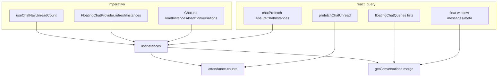

# AUDIT_REACT_QUERY_RUNTIME — S0.4.1-A

**Modo:** READ ONLY  
**Data:** 2026-06-23  
**Base:** pós S0.3 (bundle) + `AUDIT_S0_4_RUNTIME_PERFORMANCE.md`  
**Escopo:** `src/` — React Query (`@tanstack/react-query` v5)  
**Defaults:** `src/lib/queryClient.ts` — `staleTime` 5 min, `refetchOnWindowFocus/Mount/Reconnect` **false**

---

## Executive summary

O projeto usa **~55 `useQuery` / `useInfiniteQuery`** e **~130 chamadas `invalidateQueries`** (contagem por arquivo). Não há `refetchQueries`, `resetQueries` ou `cancelQueries`. **Nenhuma invalidação usa `exact: true`** — todas são **prefix match** (comportamento default v5).

Os três problemas estruturais:

1. **Famílias genéricas** — `['floating-chat']`, `['clients']`, `['leads']`, `['tickets']` invalidam dezenas de queries por evento.
2. **Chat fora do React Query** — `/chat` guarda conversas/instâncias em `useState` + `loadConversations()`; prefetch RQ e float chat **não alimentam** a página principal.
3. **Badges e contadores imperativos** — header/sidebar ignoram cache (`useChatNavUnreadCount`, `useInAppNotificationBadges`, `useTicketMenuCount`).

**Estimativa global:** 30–50% dos requests CRM autenticados são **duplicados ou evitáveis** com hardening RQ (sem alterar UX).

---

## 1. Inventário completo de query keys

### 1.1 Taxonomia (famílias)

| Família | Padrão de key | Especificidade | Consumidores |
|---------|---------------|----------------|--------------|
| `clients` | `['clients']` | **Genérica** (prefix) | Invalidações Chat, Agenda, FloatingChat |
| `clients` | `['clients', 'list', tenantId, userId]` | **Específica** ✅ | `Clients.tsx`, prefetch nav |
| `clients` | `['clients', 'tickets-list', userId]` | Escopada | `Tickets.tsx` |
| `clients` | `['clients', 'task-picker', tenantId, userId]` | Escopada | `Tasks.tsx` |
| `clients` | `['clients', 'ticket-detail', clientId]` | Escopada | `TicketDetail.tsx` |
| `clients` | `['clients', 'contracts-list', userId]` | Escopada | `Contracts.tsx` |
| `leads` | `['leads']` | **Genérica** | Invalidações Chat, Float, EmbeddedLead |
| `leads` | `['leads', tenantId, userId, sortField, sortDir, filter]` | **Específica** ✅ | `Leads.tsx` |
| `leadStatuses` | `['leadStatuses', tenantId, userId]` | Específica ✅ | `Leads.tsx` |
| `floating-chat` | `['floating-chat']` | **Genérica** | ~25 invalidações |
| `floating-chat` | `['floating-chat', 'conversations', ids, scope, quick]` | Específica ✅ | List, prefetch |
| `floating-chat` | `['floating-chat', 'messages', conversationId]` | Específica ✅ | Window, overlay |
| `floating-chat` | `['floating-chat', 'conversation-meta', id]` | Específica ✅ | Meta |
| `floating-chat` | `['floating-chat', 'connected-instances']` | **Global compartilhada** | Window, overlay (3× `listInstances`) |
| `chat` | `['chat', 'instances', tenantId, userId]` | Específica ✅ | `chatPrefetch.ts` |
| `chat` | `['chat', 'nav-unread', tenantId, userId, idsKey, scope]` | Específica ✅ | Prefetch only — **hook não usa** |
| `chat-conversations` | — | **Órfã** | Só invalidada em `Chat.tsx`; **nenhum `useQuery`** |
| `lead-conversations` / `client-conversations` | — | **Órfãs?** | Só invalidadas em `Chat.tsx` |
| `chat-runtime-config` | `['chat-runtime-config']` | Global | `Chat.tsx` |
| `client-groups` | `['client-groups']` | Global | `Chat.tsx` |
| `chat-scheduled-messages` | `['chat-scheduled-messages', conversationId]` | Específica ✅ | Strip + dialogs |
| `dashboard-overview` | `[tenantId, userId, preset]` | Específica ✅ | Dashboard + prefetch |
| `projects` | `['projects', teamFilter]` | Semi-específica | `Projects.tsx` |
| `teams` | `['teams']` | Global | `Projects.tsx` (duplicada no queryFn) |
| `members` | `['members']` | Global | Agenda, Projects |
| `members` | `['members', 'tickets-kanban' \| 'ticket-detail']` | Escopada | Tickets |
| `tasks` | `['tasks', 'unified', tenantId, userId, …]` | Específica ✅ | Tasks, prefetch |
| `tickets` | `['tickets', 'kanban', …]` | Específica ✅ | TicketsKanban |
| `tickets` | `['tickets']` | **Genérica** | `TicketDetail`, `TicketsKanban` invalidate |
| `appointments` | `['appointments', …]` | Hierárquica ✅ | Agenda (10+ subkeys) |
| `proposals` | `['proposals', 'lead-popup', leadId, cid]` | Específica ✅ | LeadProposalsTab |
| `proposals` | `['proposals']` | **Genérica** | `Leads.tsx` invalidate |
| Integrações | `google-calendar-status`, `google-drive-status` | Global | Settings lazy sections |
| Finance / drive | `project-financial-*`, `client-google-drive-browser`, … | Específica ✅ | ProjectFinance, Drive |

### 1.2 Inventário por arquivo (useQuery / useInfiniteQuery)

| Arquivo | Linha | queryKey | Hook | Endpoint / service |
|---------|-------|----------|------|-------------------|
| `Dashboard.tsx` | 79 | `["dashboard-overview", tenantId, userId, preset]` | useQuery | `GET /api/dashboard/overview` |
| `DashboardActivationBlock.tsx` | 254 | `["dashboard", "activation-checklist"]` | useQuery | `dashboardService.getActivationChecklist()` |
| `Clients.tsx` | 364 | `["clients","list", tenantId, userId]` | useQuery | `/api/client-groups` + `/api/clients` |
| `Leads.tsx` | 150 | `["leadStatuses", tenantId, userId]` | useQuery | `/api/lead-statuses` |
| `Leads.tsx` | 165 | `["leads", tenantId, userId, sort, dir, filter]` | useQuery | `/api/leads` |
| `Projects.tsx` | 246 | `["teams"]` | useQuery | `teamsService.getTeams()` |
| `Projects.tsx` | 251 | `["projects", teamFilter]` | useQuery | teams + projects + clients (batch) |
| `Projects.tsx` | 601 | `["members"]` | useQuery | `membersService.getMembers()` |
| `Tasks.tsx` | 136 | `tasksInfiniteListQueryKey(...)` | useInfiniteQuery | `tasksService.getTasks()` |
| `Tasks.tsx` | 166 | `["clients","task-picker", tenantId, userId]` | useQuery | `clientsService.getClients()` |
| `Tasks.tsx` | 173 | `tasksSummaryQueryKey(...)` | useQuery | `tasksService.getTasksSummary()` |
| `Chat.tsx` | 814 | `['client-groups']` | useQuery | `clientsService.getClientGroups()` |
| `Chat.tsx` | 820 | `['chat-runtime-config']` | useQuery | `chatService.getChatRuntimeConfig()` |
| `AgendaPage.tsx` | 323–541 | `QK_*`, `['members']`, … | useQuery ×9 | appointments API |
| `AgendaReportsView.tsx` | 138 | `['appointments','reports', params]` | useQuery | reports summary |
| `AgendaHolidaysTab.tsx` | 52 | `["appointment_holidays", listYear]` | useQuery | holidays API |
| `AgendaAvailabilityBlocksTab.tsx` | 95 | `["appointment_availability_blocks", params]` | useQuery | blocks API |
| `GoogleCalendarSection.tsx` | 22 | `['google-calendar-status']` | useQuery | Google status |
| `GoogleDriveSection.tsx` | 23 | `['google-drive-status']` | useQuery | Drive status |
| `TicketDetail.tsx` | 66–114 | `ticket`, `ticket-messages`, … | useQuery ×6 | tickets API |
| `Tickets.tsx` | 38 | `['clients','tickets-list', userId]` | useQuery | clients list |
| `TicketsKanban.tsx` | 47–69 | `['tickets','kanban',…]`, stats, members | useQuery ×3 | tickets + members |
| `Contracts.tsx` | 148 | `["clients","contracts-list", userId]` | useQuery | clients |
| `ClientProfile.tsx` | 882 | `["client-profile","chat-connected-instances"]` | useQuery | `listInstances()` |
| `ClientProfileTicketsTab.tsx` | 37 | `["client-tickets", clientId]` | useQuery | tickets by client |
| `ClientAppointmentsHistory.tsx` | 37 | `['appointments','client', clientId]` | useQuery | client appointments |
| `ClientUpcomingAppointments.tsx` | 83 | `['appointments','client', clientId]` | useQuery | **mesma key** que History |
| `ClientDriveFileManager.tsx` | 107 | `['client-google-drive-browser', …]` | useQuery | Drive browser |
| `ProjectFinance.tsx` | 47–72 | `project-financial-*`, accounts | useQuery ×4 | project finance |
| `FloatingConversationList.tsx` | 41 | `floatingChatConversationsQueryKey(...)` | useQuery | merged conversations |
| `FloatingChatWidget.tsx` | 73 | `floatingChatBubbleQueryKey(...)` | useQuery | bubble recent |
| `FloatingConversationWindow.tsx` | 149–325 | meta, messages, connected-instances | useQuery ×3 | chat API |
| `MobileConversationOverlay.tsx` | 132–169 | idem float window | useQuery ×3 | chat API |
| `MinimizedChatDock.tsx` | 61 | `['floating-chat','minimized-meta', …]` | useQuery | meta batch |
| `FloatingCompactProfile.tsx` | 102–109 | group + crm profile | useQuery ×2 | chat profile |
| `useFloatingConversationIdentity.ts` | 15 | crm profile | useQuery | profile |
| `EmbeddedLeadConversationPanel.tsx` | 135–157 | lead-profile keys | useQuery ×3 | instances + conv + messages |
| `ChatContactProfileSummary.tsx` | 139 | `['client-financial-summary', clientId]` | useQuery | financial summary |
| `ChatContactInvoiceHistorySection.tsx` | 35 | `['customer-invoices-chat-preview', clientId]` | useQuery | invoices |
| `ChatScheduledMessagesStrip.tsx` | 37 | `chatScheduledMessagesQueryKey(id)` | useQuery | scheduled messages |
| `useEntityQuickViewMetrics.ts` | 28–46 | entity-drawer-* | useQuery ×3 | financial, tickets, conv |
| `LeadProposalsTab.tsx` | 117 | `["proposals","lead-popup", …]` | useQuery | proposals |
| `ConnectionsPage.tsx` | 11 | `['superadmin-connections-summary']` | useQuery | superadmin |

**Fora do React Query (relevante):**

| Arquivo | Dados | Mecanismo |
|---------|-------|-----------|
| `Chat.tsx` | conversas, instâncias, clientes, leads | `useState` + `loadConversations` / `loadInstances` |
| `CompanyDataSection.tsx` | empresa | `useEffect` + `getMyTenantCompany()` |
| `useChatNavUnreadCount.ts` | badge chat | `useState` + service direto |
| `useInAppNotificationBadges.ts` | badges header | service direto + poll 45s |
| `useTicketMenuCount.ts` | badge tickets | service direto + poll 60s |
| `HeaderNotificationBell.tsx` | lista notificações | fetch ao abrir dropdown |

### 1.3 Resposta direta

**Genéricas (prefix match perigoso):**

- `['floating-chat']` — invalida listas, mensagens, meta, bubble, minimized, crm-profile
- `['clients']` — invalida todas variantes `clients/*`
- `['leads']` — invalida todas listas leads do tenant
- `['tickets']` — invalida kanban + detail caches
- `['chat']` — reset WA (`whatsappInstanceCacheReset`)
- `['proposals']` — invalidação em `Leads.tsx`
- `['members']` — colisão potencial Agenda ↔ Projects
- `['teams']` — global sem tenant

**Específicas (boas práticas já usadas):**

- `['clients', 'list', tenantId, userId]`
- `['floating-chat', 'messages', conversationId]`
- `['dashboard-overview', tenantId, userId, preset]`
- `['tasks', 'unified', tenantId, userId, …]`
- `['appointments', …]` subkeys
- `chatScheduledMessagesQueryKey`, `tasksSummaryQueryKey`, `chatInstancesQueryKey`

**Órfãs (invalidadas mas sem consumer RQ):**

- `['chat-conversations']` — `Chat.tsx` L1910, L3761
- `['lead-conversations']`, `['client-conversations']` — `Chat.tsx` L3762-3763

---

## 2. Mapa completo de invalidações

**Nota v5:** ausência de `exact: true` ⇒ **prefix match** em todas.

**Não existem no codebase:** `refetchQueries`, `resetQueries`, `cancelQueries`.  
**Único `removeQueries`:** `whatsappInstanceCacheReset.ts` L6 — `['floating-chat']`.

### 2.1 Por severidade (agrupado)

#### P0 — invalidação ampla / alto fan-out

| Arquivo | Linha | queryKey | Motivo | Queries atingidas (est.) | Endpoints refetch |
|---------|-------|----------|--------|--------------------------|-------------------|
| `Chat.tsx` | 3759-3765 | `floating-chat`, `chat-conversations`, `lead/client-conversations`, `clients`, `leads` | Delete conversa | **15–40+** | lists, messages, clients, leads |
| `Chat.tsx` | 637, 1909, 3759 | `['floating-chat']` | Sync float após acções | **10–30** | float family |
| `FloatingConversationWindow.tsx` | 548, 568, 634 | `['floating-chat']` + CRM | Link client/lead | **10–25** | idem |
| `FloatingCompactProfile.tsx` | 243, 300, 331 | `['floating-chat']`, `clients`, `leads` | CRM actions | **15–35** | idem |
| `EmbeddedLeadConversationPanel.tsx` | 124-125 | `floating-chat`, `leads` | afterSend | **10–20** | leads list + float |
| `lib/whatsappInstanceCacheReset.ts` | 5-9 | float, chat, runtime, connections | WA removed | **20+** | chat ecosystem |
| `Leads.tsx` | 346 | `['floating-chat']` | Kanban drag | **10–30** | float lists |

#### P1 — prefix moderado

| Arquivo | Linha | queryKey | Motivo | Queries atingidas |
|---------|-------|----------|--------|-------------------|
| `Chat.tsx` | 3052-3908 | `['clients']`, `['leads']` | CRM link/unlink | 3–8 each |
| `AgendaPage.tsx` | 1018-1190 | `['clients']` ×5 | Após criar cliente na agenda | clients variants |
| `TicketDetail.tsx` | 125 | `['tickets']` | Update ticket | kanban + lists |
| `TicketsKanban.tsx` | 85 | `['tickets']` | Bulk action | all ticket queries |
| `Leads.tsx` | 820 | `['proposals']` | Proposal action | proposal queries |
| `ClientProfile.tsx` | 905, 974 | `['floating-chat']` | Chat actions | float family |

#### P2 — granular / aceitável

| Arquivo | queryKey | Motivo |
|---------|----------|--------|
| `floatingChatQueries.ts` | `conversations`, `bubble-recent`, `minimized-meta` | Aggregates only ✅ |
| `FloatingChatProvider.tsx` | messages/meta por `cid` | Realtime message ✅ |
| `FloatingConversationWindow.tsx` | messages/meta por id | Send/receive ✅ |
| `Projects.tsx` | `PROJECTS_QUERY_KEY` | CRUD project ✅ |
| `Clients.tsx` | scoped clients list | CRUD client ✅ |
| `ClientDriveFileManager.tsx` | drive browser scoped | Upload ✅ |
| `chatScheduledMessagesStrip` | per conversation | Schedule ✅ |
| Settings agenda tabs | QK_BLOCKS, QK_HOLIDAYS | Local settings ✅ |

### 2.2 Inventário completo por arquivo (contagens)

| Arquivo | invalidate | remove |
|---------|------------|--------|
| `Chat.tsx` | 20 | 0 |
| `FloatingConversationWindow.tsx` | 18 | 0 |
| `FloatingCompactProfile.tsx` | 16 | 0 |
| `MobileConversationOverlay.tsx` | 13 | 0 |
| `EmbeddedLeadConversationPanel.tsx` | 12 | 0 |
| `FloatingChatProvider.tsx` | 9 | 0 |
| `Leads.tsx` | 7 | 0 |
| `Clients.tsx` | 6 | 0 |
| `AgendaPage.tsx` | 6 | 0 |
| `TicketDetail.tsx` | 5 | 0 |
| `whatsappInstanceCacheReset.ts` | 4 | 1 |
| `floatingChatQueries.ts` | 4 | 0 |
| Demais | 1–3 cada | 0 |

---

## 3. Duplicação de requests

| # | Arquivo(s) | Endpoint | Duplicação | Ganho est. |
|---|------------|----------|------------|------------|
| 1 | `useChatNavUnreadCount` vs `chatPrefetch.prefetchChatUnread` | `listInstances` + `attendance-counts` | Hook **ignora** `chatUnreadQueryKey` | **−2 req** / refresh badge |
| 2 | `FloatingChatProvider.refreshInstances` vs `ensureChatInstances` | `listInstances` | Service direto vs RQ | **−1 req** on float mount |
| 3 | `FloatingConversationWindow` + `MobileOverlay` + `EmbeddedLead` | `listInstances` | Key `connected-instances` shared but **3 mount paths** | **−1–2 req** se dedup |
| 4 | `Chat.tsx` `loadInstances` vs prefetch `chat.instances` | `listInstances` | Chat page **não usa RQ** | **−1 req** entering /chat after prefetch |
| 5 | `Chat.tsx` `loadConversations` vs float `floatingChatConversationsQueryKey` | conversations merge API | Estado local vs RQ cache | **−2–4 req** on /chat |
| 6 | `prefetchClientsListNav` vs `Clients.tsx` mount | groups + clients | **Mesma key** ✅ hit se idle completou | 0 se stale OK |
| 7 | `prefetchLeadsListNav` vs `Leads.tsx` | `/api/leads` | **Key mismatch** — prefetch `name,asc,all` vs sort/filter page | **Prefetch perdido** |
| 8 | `prefetchDashboardOverview` vs Dashboard | overview | Key match só se `preset=current_month` | Miss se user muda período |
| 9 | `Projects.tsx` teams query + projects queryFn | `getTeams()` | **2× teams** no mount projects | **−1 req** |
| 10 | `useInAppNotificationBadges` + `HeaderNotificationBell.loadList` | `unread-count` system/message | Categorias diferentes; bell refetch on open | Moderado |
| 11 | `MobileAppNavigation` + `useInAppNotificationBadges` | `updates/unread-count` | **2 consumidores** updates | **−1 req** on mobile |
| 12 | `ClientAppointmentsHistory` + `ClientUpcomingAppointments` | same appointments key | **Cache hit** se ambos montados ✅ | — |
| 13 | `AgendaPage` `['members']` vs `Projects` `['members']` | members | Keys **diferentes** (`members` vs scoped) | **−1 req** se unificar |
| 14 | `Tickets.tsx` clients vs `Clients` list | `/api/clients` | Keys diferentes | **−1 req** cross-nav |
| 15 | `Chat.tsx` `getOperationsDashboard` | operations dashboard | useEffect direto; duplicado em `ChatOperationalPanel` | **−1 req** se shared RQ |

---

## 4. Prefetch

### 4.1 Inventário

| Origem | API | queryKey / alvo | staleTime |
|--------|-----|-----------------|-----------|
| `prefetchAppData.prefetchDashboardOverview` | overview | `dashboard-overview, tenant, user, current_month` | 60s |
| `prefetchAppData.prefetchClientsListNav` | groups+clients | `clients, list, tenant, user` | 60s |
| `prefetchAppData.prefetchLeadsListNav` | leads | `leads, tenant, user, name, asc, all` | 60s |
| `prefetchAppData.prefetchTasksSummaryNav` | summary | `tasks, unified, tenant, user, summary` | 60s |
| `chatPrefetch.ensureChatInstances` | instances | `chat, instances, tenant, user` | 120s |
| `chatPrefetch.prefetchChatUnread` | attendance-counts | `chat, nav-unread, …` | 10s |
| `chatPrefetch.prefetchChatCore` | lists mine/unread/bubble + messages×3 | float keys | 90s–180s |
| `floatingChatQueries.prefetchFloatingChatLists` | bubble + all | float keys | 180s |
| `FloatingChatProvider` L117 | chama prefetch lists | após `refreshInstances` | — |
| `routePreload.*` | **JS chunks only** | não é RQ | — |
| `AppShellSidebar` idle | combina routePreload + prefetchAppData + chatPrefetch | — | — |

### 4.2 Cache hit vs perdido

| Prefetch | Hit esperado? | Motivo |
|----------|---------------|--------|
| Clients list | **Alto (~80%)** | Key idêntica à página |
| Dashboard overview | **Médio (~50%)** | Só `current_month`; troca preset = miss |
| Tasks summary | **Alto** | Key idêntica |
| Leads list | **Baixo (~10%)** | Key prefetch ≠ key página (sort/filter) |
| Chat instances | **Baixo para /chat** | Chat page não lê RQ |
| Chat unread prefetch | **Zero** | `useChatNavUnreadCount` bypass |
| Float lists | **Alto para float** | Provider prefetch; **não** para /chat |
| Chat conversations mine/unread | **Médio** | Só se float/kanban filters align |

### 4.3 Redundantes / nunca usados

- **`prefetchLeadsListNav`** — quase sempre miss (key drift).
- **`prefetchChatUnread`** — populado mas **nunca lido** por consumer.
- **`['chat-conversations']` invalidation** — sem query registrada.
- **Route preload 6 rotas no idle** — bandwidth JS, não RQ; competição com prefetch API.

---

## 5. Badges

| Superfície | Dado | Mecanismo | API | RQ? | Poll? |
|------------|------|-----------|-----|-----|-------|
| **Header** notif sistema | unread system | `useInAppNotificationBadges` | `/api/notifications/unread-count?category=system` | **Não** | **45s** |
| **Header** updates | unread updates | idem | `/api/announcements/updates/unread-count` | **Não** | **45s** |
| **Header** bell dropdown | list + message unread | `HeaderNotificationBell` on open | list + `unread-count?category=message` | **Não** | on open |
| **Sidebar** chat | unread conv count | `useChatNavUnreadCount` | instances + attendance-counts | **Não** (prefetch órfão) | **120s** + events |
| **Sidebar** tickets | menu count | `useTicketMenuCount` | `/api/tickets/menu-count` | **Não** | **60s** |
| **Floating Chat** bubble | unread per conv | RQ meta + lists | from conversation objects | **Sim** | via invalidate |
| **Mobile nav** updates | updates badge | `MobileAppNavigation` | updates unread-count | **Não** | event only |
| **Mobile nav** chat | unread | shared context | via sidebar hook | **Não** | same |
| **Dashboard** | tickets preview, chat list | inside `dashboard-overview` | single overview API | **Sim** | — |

**Consolidável:** 4 endpoints shell → 1 (`/api/header/summary`) + 1 RQ query `['header-summary', tenantId, userId]`.

---

## 6. Chat — auditoria dedicada

### 6.1 Fluxo actual



### 6.2 Requests elimináveis com RQ

| Request | Substituir por | Impacto |
|---------|----------------|---------|
| `useChatNavUnreadCount` manual | `useQuery(chatUnreadQueryKey)` | Badge usa prefetch |
| `FloatingChatProvider.refreshInstances` | `useQuery(chatInstancesQueryKey)` | 1 mount req |
| `Chat loadInstances` | `useQuery(chatInstancesQueryKey)` | /chat cache hit |
| `Chat loadConversations` | `useQuery(floatingChatConversationsQueryKey(...))` + `setQueryData` realtime | /chat + float unified |
| `connected-instances` ×3 | single shared query + `enabled` | −2 listInstances |
| Invalidates `['floating-chat']` | `invalidateFloatingChatAggregates` + meta por id | −80% refetch |

---

## 7. Cache hit rate estimado (1ª visita → revisit ≤5 min)

| Rota | Queries principais | Hit esperado | Cache perdido | Motivo |
|------|-------------------|--------------|---------------|--------|
| **Dashboard** | overview, activation | **60–70%** overview | preset ≠ current_month | prefetch parcial |
| **Clients** | clients list | **75–85%** | first visit before idle | prefetch nav OK |
| **Projects** | projects, teams, members | **20–40%** | teams 2×; no prefetch | no nav prefetch |
| **Settings** | company (no RQ) | **0% RQ** | always fetch | CompanyDataSection imperativo |
| **Chat** | runtime, groups + local state | **10–20%** | conversations, instances | fora do RQ |
| **Agenda** | 9 queries | **30–50%** | members, gcal | no prefetch; heavy mount |
| **Leads** | statuses + leads | **10–30%** leads | prefetch key drift | sort/filter mismatch |

**Global estimado (sessão 30 min, navegação típica):** **~45–55% hit rate** actual → meta pós S0.4.1-B **~70–80%**.

---

## 8. Request waterfall

```
AppShell mount (idle ≤3s)
├── prefetch dashboard-overview     [RQ]  ─────────────────┐
├── prefetch clients/list           [RQ]  ───────────┐     │
├── prefetch tasks/summary          [RQ]               │     │
├── prefetchChatCore                [RQ]  ───┐         │     │
│   ├── chat/instances              [RQ]     │         │     │
│   ├── attendance-counts           [RQ] ★orphan       │     │
│   ├── float lists ×4              [RQ]     │         │     │
│   └── messages ×3                 [RQ]     │         │     │
├── useChatNavUnreadCount           [API] ★bypass ─────┼─────┼── listInstances + counts
├── useInAppNotificationBadges      [API] ×2  poll       │     │
└── useTicketMenuCount              [API] poll           │     │

Navigate /dashboard
└── useQuery overview ────────────── HIT if same preset ─┘

Navigate /clients
└── useQuery clients list ────────── HIT ────────────────┘

Navigate /projects
├── useQuery teams ───────────────── MISS (no prefetch)
├── useQuery projects (+ teams+clients inside queryFn) ── teams DUPLICATE
└── useQuery members ─────────────── MISS

Navigate /settings (default)
└── getMyTenantCompany() ─────────── NO RQ (always network)

Navigate /chat
├── useQuery client-groups ────────── MAYBE miss
├── useQuery chat-runtime-config ──── MAYBE miss
├── loadInstances() ──────────────── DUPLICATE (prefetch instances)
├── loadConversations() ──────────── DUPLICATE (prefetch lists)
├── getOperationsDashboard() ─────── NO RQ
└── socket.io dedicated ───────────── (fora RQ)

★ = ignora cache React Query
```

---

## 9. Top 20 quick wins

| # | Descrição | Ganho | Risco | Esforço | P |
|---|-----------|-------|-------|---------|---|
| 1 | Migrar `useChatNavUnreadCount` → `useQuery(chatUnreadQueryKey)` | −2 API/refresh; prefetch útil | Baixo | S | **P0** |
| 2 | Substituir `invalidateQueries(['floating-chat'])` por `invalidateFloatingChatAggregates` + scoped | −50–80% refetch chat | Médio | M | **P0** |
| 3 | Unificar `listInstances` em `chatInstancesQueryKey` (Chat, Float, Profile) | −3–5 req/sessão | Médio | M | **P0** |
| 4 | Migrar `Chat.tsx` conversas para RQ (shared float keys) | −2–4 req em /chat | Alto | L | **P0** |
| 5 | Remover invalidações órfãs `chat-conversations`, `lead/client-conversations` | Clareza; evita no-op scans | Nulo | S | **P1** |
| 6 | Escopar invalidações `['leads']` → `['leads', tenantId, userId]` | −refetch listas alheias | Baixo | S | **P1** |
| 7 | Escopar `['clients']` → `['clients', 'list', tenant, user]` | −refetch picker/tickets | Baixo | S | **P1** |
| 8 | Alinhar `prefetchLeadsListNav` key com `Leads.tsx` default | +30% hit leads | Baixo | S | **P1** |
| 9 | `FloatingChatProvider`: `useQuery` instances vs `refreshInstances` | −1 req float | Baixo | S | **P1** |
| 10 | Header badges → single RQ `header-summary` query | −3–4 req/min/user | Médio | M | **P1** |
| 11 | Remover poll 45s badges se realtime + RQ stale | −2 req/45s | Baixo | S | **P1** |
| 12 | Dedup `getTeams()` em `Projects` queryFn | −1 req projects mount | Baixo | S | **P1** |
| 13 | Unificar `['members']` keys cross-pages | −1 req cross-nav | Baixo | M | **P1** |
| 14 | `CompanyDataSection` → RQ `['tenant-company', tenantId]` | cache settings revisit | Baixo | S | **P2** |
| 15 | `getOperationsDashboard` → RQ shared | −1 req chat | Baixo | S | **P2** |
| 16 | Mobile updates badge → contexto RQ header | −1 req mobile | Baixo | S | **P2** |
| 17 | `TicketsKanban` invalidate `['tickets','kanban',…]` scoped | −refetch ticket detail | Baixo | S | **P2** |
| 18 | `useQuery` `connected-instances` singleton hook | −2 listInstances | Baixo | M | **P2** |
| 19 | Adicionar `exact: true` onde invalidação granular | previne fan-out acidental | Baixo | M | **P2** |
| 20 | Centralizar keys em `src/lib/queryKeys/` | manutenção; menos drift | Nulo | M | **P2** |

*Esforço: S &lt; 4h, M 1–2d, L 3–5d*

---

## 10. Roadmap S0.4.1-B — React Query Hardening

Ordem ideal (dependências primeiro):

### Fase B1 — P0 (semana 1)

1. **Query keys registry** — `src/lib/queryKeys/{clients,leads,chat,header}.ts`
2. **`useChatNavUnreadCount` → RQ** — consumir `chatUnreadQueryKey`
3. **Invalidation sweep** — replace `['floating-chat']` broad → aggregates + per-id (Chat, Float, EmbeddedLead)
4. **`chatInstancesQueryKey` shared hook** — Float provider + prefetch + consumers

### Fase B2 — P1 (semana 2)

5. **Chat page RQ migration** — conversations + instances (feature flag `VITE_CHAT_RQ_LIST`)
6. **Scoped invalidations** — `clients`, `leads`, `tickets` com tenant/user
7. **Prefetch alignment** — leads key; dashboard preset-aware prefetch
8. **Header summary query** (frontend only primeiro; mock até backend)

### Fase B3 — P2 (semana 3)

9. **Settings CompanyData → RQ**
10. **Members/clients dedup** cross Tickets/Agenda/Projects
11. **`exact: true` audit** on granular invalidations
12. **Remove dead keys** — `chat-conversations`, orphan invalidations
13. **Metrics** — dev-only RQ cache hit logger (`queryClient.getQueryCache().subscribe`)

### Critérios de aceite S0.4.1-B

| Métrica | Actual | Meta |
|---------|--------|------|
| `listInstances` calls / sessão 30 min | ~8–15 | **≤4** |
| Invalidações `['floating-chat']` broad / hora chat activo | ~50+ | **0** |
| Cache hit nav Clients/Dashboard | ~70% | **≥85%** |
| Badge refresh sem rede (realtime event) | 0% | **≥90%** |

---

## Referências de código

```16:27:src/lib/queryClient.ts
export const queryClient = new QueryClient({
  defaultOptions: {
    queries: {
      staleTime: 5 * 60 * 1000,
      refetchOnWindowFocus: false,
      refetchOnMount: false,
```

```28:33:src/features/floating-chat/floatingChatQueries.ts
export function invalidateFloatingChatAggregates(queryClient: QueryClient): void {
  void queryClient.invalidateQueries({ queryKey: ['floating-chat', 'conversations'] });
  void queryClient.invalidateQueries({ queryKey: ['floating-chat', 'bubble-recent'] });
  void queryClient.invalidateQueries({ queryKey: ['floating-chat', 'minimized-meta'] });
```

```20:46:src/hooks/useChatNavUnreadCount.ts
  const refresh = useCallback(async () => {
    // ...
    const instances = await chatService.listInstances();
    // ...
    const c = await chatService.getConversationAttendanceCounts({ instanceIds, inboxScope });
```

```53:64:src/lib/chatPrefetch.ts
  const instances = await qc.ensureQueryData({
    queryKey: chatInstancesQueryKey(tenantId, userId),
    queryFn: () => chatService.listInstances(),
```

```969:985:src/pages/Chat.tsx
  const loadInstances = useCallback(async () => {
    // ...
    const data = await chatService.listInstances();
    setInstances(data);
```

```131:131:src/pages/Clients.tsx
const CLIENTS_QUERY_KEY = ["clients", "list"] as const;
```

```97:105:src/lib/prefetchAppData.ts
  prefetchNavQuery({
    queryKey: ["leads", tenantId, userId, "name", "asc", "all"],
    queryFn: async () => { /* /api/leads */ },
```

```164:165:src/pages/Leads.tsx
  const { data: leadsData } = useQuery({
    queryKey: ["leads", tenantId, userId, sortField, sortDirection, activeStatusFilter],
```

---

## Métricas resumo

| Indicador | Valor |
|-----------|-------|
| `useQuery` / `useInfiniteQuery` | ~55 |
| Famílias de queryKey distintas | ~35 |
| `invalidateQueries` calls | ~130 |
| `removeQueries` | 1 |
| `refetchQueries` / `resetQueries` / `cancelQueries` | 0 |
| Invalidações P0 (broad float/clients/leads) | ~45 |
| Hooks badge fora RQ | 3 |
| Páginas core sem RQ (Chat lists, Settings company) | 2 |
| Prefetch com key drift confirmado | 1 (leads) |

---

*Auditoria READ ONLY — nenhum código alterado. Próximo passo: S0.4.1-B implementação conforme roadmap §10.*
