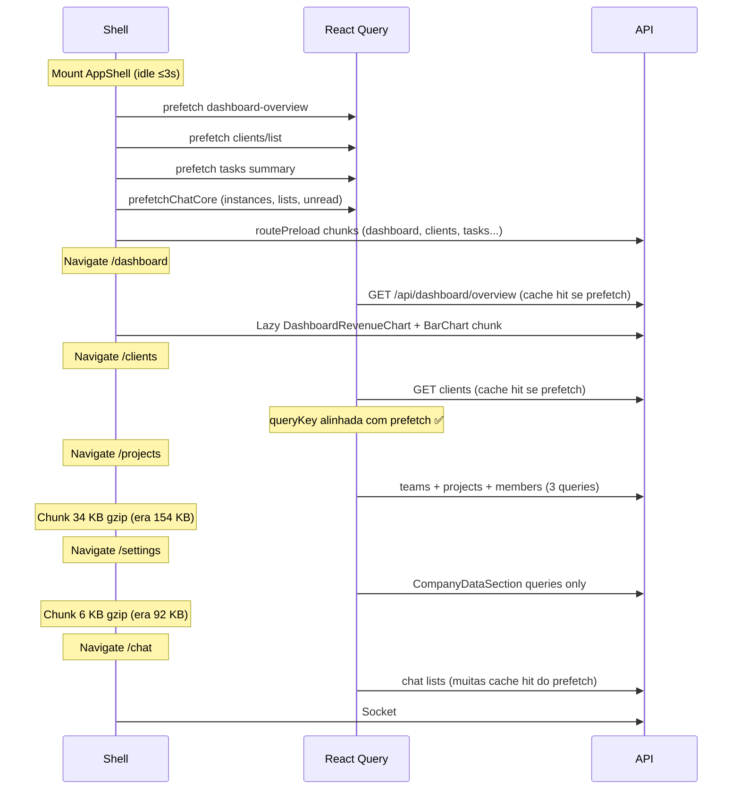

# AUDIT_S0_4_RUNTIME_PERFORMANCE

**Modo:** READ ONLY  
**Data:** 2026-06-23  
**Base:** S0.1, S0.2, S0.3.1-A, S0.3.2-A, S0.3.3 concluídos  
**Build de referência:** `npm run build:crm` (2026-06-23, pós S0.3.2-A)  
**Baseline histórico:** `PERFORMANCE_FORENSICS_V2.md` (pré S0.3.1-A / S0.3.2-A / S0.3.3)

---

## Executive summary

As otimizações de bundle (S0.3.x) removeram **~120 KB gzip** dos critical paths de `/projects`, `/settings` e `/dashboard`. Os maiores gargalos **restantes** estão no **runtime paralelo**: sockets duplicados, polling de badges no header, prefetch idle agressivo, invalidações amplas de React Query e re-renders em cascata no shell.

| Área | Situação pós S0.3 | Gargalo principal restante |
|------|-------------------|----------------------------|
| Bundle rotas | Projects 154→34 KB; Settings 92→6 KB; Dashboard sem Recharts no 1º paint | Chat 55 KB, Agenda 39 KB, bootstrap ~229 KB gzip |
| Polling | Padrão inalterado | Badges 45s/60s/120s + Kanban ops 20s |
| Socket.IO | Singleton mantido | +1 socket dedicado por Chat / ClientProfile / Kanban |
| React Query | Defaults conservadores ✅ | Invalidações `['floating-chat']`, `['leads']`, `['clients']` |
| Re-renders | Shell memo parcial ✅ | `ChatNavUnreadProvider` no topo do shell; `FloatingChatProvider` pulse 500ms |

---

## 1. Polling

### 1.1 Inventário completo (CRM autenticado + shell)

| Local | Hook / componente | Frequência | Endpoint(s) | Necessário? | Realtime substitui? | Pode reduzir? |
|-------|-------------------|------------|-------------|-------------|---------------------|---------------|
| `useInAppNotificationBadges.ts` | Header badges | **45s** + eventos `UPDATES_REFRESH_EVENT` + `notification.created` | `GET /api/notifications/unread-count?category=system`, `GET /api/announcements/updates/unread-count` | Parcial | **Sim** — singleton já emite `notification.created` | **Sim** — remover intervalo; manter só eventos |
| `useTicketMenuCount.ts` | Sidebar tickets badge | **60s** + `notification.created` | `GET /api/tickets/menu-count` | Parcial | Parcial — tickets não têm evento dedicado | **Sim** — estender realtime ou aumentar intervalo |
| `useChatNavUnreadCount.ts` | Sidebar chat badge | **120s** + debounce 900ms em 3 window events | `GET /api/chat/instances` (via `listInstances`) + `GET /api/chat/conversations/attendance-counts` | **Redundante** | **Sim** — mesmos eventos do singleton | **Sim** — usar cache RQ `chatUnreadQueryKey`; eliminar poll |
| `ChatKanbanPage.tsx` L237-243 | Ops Kanban refresh | **20s** | REST kanban board detail (`loadBoardDetail`) | **Redundante** | **Sim** — `useKanbanAttendanceSocketRefresh` já activo | **Sim** — remover intervalo em modo ops |
| `FloatingChatProvider.tsx` L262-277 | Pulse UI minimizada | **500ms** | — (estado local) | **Sim** | N/A | Não — apenas limpa `pulseUntil` |
| `InstancesList.tsx` L99-108 | Bootstrap sync | **8s** (condicional) | `listInstances` | **Sim** | Parcial (`channel.status_changed`) | Manter só durante `queued`/`running` |
| `InstancesList.tsx` L111-156 | QR / connecting | **15s** (condicional) | `getInstanceStatus` por instância | **Sim** | Parcial | Manter só enquanto QR aberto |
| `AppShellSidebar.tsx` L51-93 | Prefetch idle | **idle ≤3s** + fallback 2s | Múltiplos (ver §7) | Opcional (perf) | N/A | **Sim** — reduzir rotas prefetch |
| `FloatingChatDeferred.tsx` L59-70 | Load float chat | idle 5s / interação | — | **Sim** | N/A | OK |
| `lib/chatPrefetch.ts` | Chat warm | idle ≤4,5s | instances, lists, unread, messages | Opcional | N/A | **Sim** — deduplicar com `useChatNavUnreadCount` |
| `ClientDriveFileManager.tsx` L113-122 | Upload em progresso | **4s** dinâmico | Google Drive browser API | **Sim** | Não | OK — só durante upload |
| `AgendaWeekView.tsx` L155 | Relógio “agora” | **60s** | — | **Sim** | N/A | OK |
| `MobileAppNavigation.tsx` L150-155 | Updates badge mobile | mount + evento (sem interval) | `GET /api/announcements/updates/unread-count` | Parcial | Evento já existe | Dedup com header |

### 1.2 Polling fora do escopo CRM shell (referência)

| Local | Frequência | Contexto |
|-------|------------|----------|
| `PlanCheckout.tsx`, `InternalBillingCheckout.tsx`, `PublicSaasBillingPay.tsx` | 2,5–N s | Pagamento PIX — necessário |
| `WhatsAppConnection.tsx`, `QRCodePopup.tsx`, `useWhatsappOnboardingConnection.ts` | variável | Conexão WA — necessário |
| `AuthWhatsApp.tsx`, `ForgotPasswordWhatsapp.tsx` | countdown OTP | Auth — necessário |
| Onboarding / landing mockups | 2,4–2,6s | UI decorativa |

### 1.3 Tabela resumo (escopo obrigatório)

| Local | Frequência | Endpoint | Necessário? |
|-------|------------|----------|-------------|
| `useInAppNotificationBadges` | 45s | `/api/notifications/unread-count`, `/api/announcements/updates/unread-count` | **Parcial** — realtime cobre notificações |
| `useTicketMenuCount` | 60s | `/api/tickets/menu-count` | **Parcial** |
| `useChatNavUnreadCount` | 120s + eventos | `/api/chat/instances` + `/api/chat/conversations/attendance-counts` | **Não** (com realtime + RQ) |
| `ChatKanbanPage` (ops) | 20s | Kanban board REST | **Não** (socket hook presente) |
| `InstancesList` (Settings WA) | 8s / 15s | instances + status | **Sim** (só durante connect) |
| `FloatingChatProvider` | 500ms | — | **Sim** (UI local) |
| Sidebar idle prefetch | ~2–3s | ver §7 | **Opcional** |

---

## 2. Socket.IO

### 2.1 Mapa de conexões

| Arquivo | Socket | Singleton? | Duplicado? |
|---------|--------|------------|------------|
| `services/realtimeClient.ts` | `connectRealtime(token)` — módulo singleton | **Sim** | Base |
| `hooks/useRealtimeEvents.ts` → `AppShellRealtime.tsx` | Usa singleton | **Sim** | Não |
| `pages/Chat.tsx` L1459 | `io()` dedicado, `forceNew: true` | **Não** | **Sim** — paralelo ao singleton |
| `pages/ClientProfile.tsx` L1012 | `io()` dedicado | **Não** | **Sim** |
| `hooks/useKanbanAttendanceSocketRefresh.ts` L31 | `io()` dedicado | **Não** | **Sim** |
| `hooks/useNotifications.ts` L81 | `io()` dedicado | **Não** | **Morto** — hook não referenciado em nenhum componente |
| `components/onboarding/.../useWhatsappOnboardingConnection.ts` | `connectRealtime` | **Sim** | Não (onboarding) |
| Floating chat / Kanban cards / InstancesList | Escutam `REALTIME_WINDOW_EVENTS` (window) | Derivado | Não — sem socket extra |

**Eventos do singleton** (`realtimeClient.ts`): `message.created`, `conversation.updated`, `conversation.deleted`, `notification.created`, `channel.status_changed`, `whatsapp.instance_removed` → reemitidos como `CustomEvent` no `window`.

**Sockets dedicados usam protocolo legado** (`new_message`, `conversation_updated`, `conversation_attendance_updated`) — overlap funcional com o singleton V2.

### 2.2 Sockets simultâneos por rota (utilizador típico com chat habilitado)

| Rota | Sockets simultâneos | Detalhe |
|------|---------------------|---------|
| **Dashboard** | **1** | Singleton via `AppShellRealtime` (lazy) |
| **Chat** | **2** | Singleton + `Chat.tsx` dedicado |
| **Kanban** (`/chat/kanban`) | **2** (+ poll ops) | Singleton + `useKanbanAttendanceSocketRefresh`; ops kanban adiciona poll 20s |
| **Client Profile** | **2** (se conversa WA) | Singleton + `ClientProfile.tsx` quando `conversationId` |
| **Settings → WhatsApp** | **1** | Singleton; `InstancesList` usa window events + poll condicional (sem socket extra) |

**Com Floating Chat carregado:** sockets **não aumentam** — apenas listeners window + REST.

**Pior caso:** `/chat` + float activo = **2 sockets** (não 3).

---

## 3. React Query

### 3.1 Defaults globais (`lib/queryClient.ts`)

| Opção | Valor | Avaliação |
|-------|-------|-----------|
| `staleTime` | 5 min | Conservador ✅ |
| `refetchOnWindowFocus` | **false** | ✅ |
| `refetchOnMount` | **false** | ✅ |
| `refetchOnReconnect` | **false** | ✅ |
| `refetchInterval` global | — | Nenhum ✅ |

**Único `refetchInterval` explícito:** `ClientDriveFileManager` (4s condicional em upload).

### 3.2 Invalidações amplas (impacto)

| Local | Query Key | Problema | Severidade |
|-------|-----------|----------|------------|
| `Chat.tsx` L3759-3765 | `['floating-chat']`, `['chat-conversations']`, `['lead-conversations']`, `['client-conversations']`, `['clients']`, `['leads']` | **6 famílias** num único evento (delete conversa) | **P0** |
| `FloatingConversationWindow.tsx` L548-550 | `['floating-chat']`, `['clients','list']`, `['leads']` | Prefix match — refetch lists inteiras | **P1** |
| `FloatingCompactProfile.tsx` (múltiplos) | `['floating-chat']`, `['clients']`, `['leads']` | Mesmo padrão em acções CRM | **P1** |
| `lib/whatsappInstanceCacheReset.ts` | `['floating-chat']`, `['chat']`, `['chat-runtime-config']`, `['connections']` | Reset global WA — justificado mas pesado | **P1** |
| `Chat.tsx` L637, L1909 | `['floating-chat']` | Invalida **todas** queries float (listas + mensagens + meta) | **P1** |
| `EmbeddedLeadConversationPanel.tsx` L125 | `['leads']` sem tenant/user | Prefix — todas listas leads | **P1** |
| `AgendaPage.tsx` (5×) | `['clients']` | Prefix amplo após acções agenda | **P2** |
| `floatingChatQueries.ts` | `['floating-chat', 'conversations']` etc. | Granular ✅ | OK |

**Impacto estimado:** cada `invalidateQueries({ queryKey: ['floating-chat'] })` pode disparar **10–30 refetches** (conversas × mensagens × meta por painel aberto). Em sessão activa de chat, **dezenas de requests/minuto** sob tráfego realtime.

### 3.3 Query keys genéricas vs específicas

| Padrão | Uso | Risco |
|--------|-----|-------|
| `['leads', tenantId, userId, ...]` | `Leads.tsx` | ✅ Escopado |
| `['leads']` | Chat, FloatingChat, EmbeddedLead | ⚠️ Amplo |
| `['clients', 'list', tenantId, userId]` | Prefetch nav | ✅ |
| `['clients']` | Chat, Agenda | ⚠️ Amplo |
| `['chat', 'instances', tenantId, userId]` | `chatPrefetch.ts` | ✅ — **não usado** por `useChatNavUnreadCount` |

### 3.4 Prefetch vs hook imperativo (gap)

`prefetchChatUnread` popula `chatUnreadQueryKey`, mas `useChatNavUnreadCount` **ignora React Query** e chama `listInstances` + `attendance-counts` directamente — **cache prefetch não é aproveitado**.

---

## 4. Re-renderizações

| Componente | Renders excessivos? | Motivo |
|------------|---------------------|--------|
| **Header** (`AppShellHeader`) | Moderado | `React.memo` ✅; `overlayReady` em `GlobalSearchSlotContext` |
| **HeaderActions** | Moderado | `pathname` recalcula menu “Criar”; `useInAppNotificationBadges` state 45s |
| **Sidebar** (`AppShellSidebar`) | **Sim** | `NavLinkItem` interno usa `useLocation()` **por item** (~15 subscrições router); `ChatSidebarNavItem` / `TicketSidebarNavItem` com badges |
| **Floating Chat** (`FloatingChatProvider`) | **Sim** | Estado `panels`, `pulseUntil` (interval 500ms), `listOpen`; invalidações RQ em cada mensagem |
| **Kanban** (`ChatKanbanPage`, boards) | Moderado | `setCards` em realtime; wheel listeners nativos |
| **CRM Dashboard** | Moderado | 10+ `useFeatureFlag` + `useModulePermissions`; `useMobileShellChrome` effect mount |
| **`ChatNavUnreadProvider`** | **Sim (cascata)** | Envolve **todo** o `AppShell`; `setCount` no poll/evento re-renderiza filhos do Provider |
| **`AuthContext`** | Alto (global) | Qualquer `user`/`features` change → árvore `App.tsx` |
| **`ModulePermissionsContext`** | Moderado | `permissions` load + mapa completo; muitos consumidores |
| **`MobileShellChromeProvider`** | Moderado | Dashboard escreve `setShowMobileGlobalHeader` no mount |

**Melhorias já presentes (S0.2):** `AppShellHeader` / `AppShellSidebar` / `AppShellHeaderActions` com `React.memo`; realtime isolado em `HeaderRealtimeBridge` (render null).

---

## 5. Requests redundantes

### 5.1 Badges e contadores (shell)

| Dado | Consumidor | Endpoint | Duplicata |
|------|------------|----------|-----------|
| Notificações sistema | Header | `/api/notifications/unread-count?category=system` | — |
| Updates / novidades | Header + Mobile nav | `/api/announcements/updates/unread-count` | **2 consumidores** (header poll + mobile mount) |
| Tickets abertos | Sidebar | `/api/tickets/menu-count` | — |
| Chat unread | Sidebar | `listInstances` + `attendance-counts` | **3×** potencial: hook + `prefetchChatUnread` + `FloatingChatProvider.refreshInstances` |
| Dashboard overview | Sidebar prefetch + Dashboard mount | `/api/dashboard/overview` | OK se mesma `queryKey` (stale 60s nav) |

### 5.2 Viabilidade `GET /api/header/summary`

**Sim — alto ROI.**

Payload sugerido:

```json
{
  "notifications_unread": 3,
  "updates_unread": 1,
  "tickets_menu_count": 5,
  "chat_unread_conversations": 12
}
```

| Benefício | Estimativa |
|-----------|------------|
| Requests shell / 45–120s | **4–5 → 1** |
| Eliminação `listInstances` só para badge | **−1 request** por refresh chat nav |
| Backend | 1 query agregada vs 4 round-trips |

**Risco:** médio — novo endpoint + invalidação via realtime; **esforço:** médio (1–2 dias).

---

## 6. Memory leaks

| Arquivo | Possível leak | Gravidade |
|---------|---------------|-----------|
| `Chat.tsx` L2020-2031 | Cleanup `disconnect()` ✅ | Baixa |
| `ClientProfile.tsx` L1125-1126 | Cleanup `socket.disconnect()` ✅ | Baixa |
| `useKanbanAttendanceSocketRefresh.ts` L73-79 | Cleanup listeners + disconnect ✅ | Baixa |
| `useRealtimeEvents.ts` | `socket.off` no cleanup; **não** chama `disconnectRealtime` no unmount | Baixa — singleton intencional |
| `FloatingChatProvider.tsx` | Múltiplos `window.addEventListener` — **todos com remove** ✅ | Baixa |
| `InstancesList.tsx` L111-156 | `setInterval` depende de `[instances.length, qrCodeInstanceId]` — recria interval ao mudar lista | Baixa |
| `useNotifications.ts` | Hook órfão — se usado no futuro sem cleanup completo | Média (código morto) |
| `Chat.tsx` L1407-1431 | `fetch` teste socket **sem abort** no cleanup | Baixa |
| Kanban boards (`wheel` listener) | `removeEventListener` no cleanup ✅ | Baixa |
| `useVisualKeyboardInset` / `useMobileKeyboardOverlap` | `visualViewport` listeners com cleanup ✅ | Baixa |

**Nenhum leak crítico confirmado** — padrão geral de cleanup adequado; risco residual em sockets duplicados (conexões órfãs se navegação rápida entre Chat ↔ Profile).

---

## 7. Network waterfall

Fluxo: **Dashboard → Clients → Projects → Settings → Chat**

### 7.1 Diagrama simplificado



### 7.2 Repetições identificadas

| Navegação | Repetição | Mitigação existente | Gap |
|-----------|-----------|---------------------|-----|
| Shell → Dashboard | overview | `prefetchDashboardOverview` | OK |
| Shell → Clients | clients + groups | `prefetchClientsListNav` | OK |
| Shell → Chat | instances, lists, unread | `prefetchChatCore` idle | `useChatNavUnreadCount` **re-fetcha** fora do RQ |
| Qualquer → Chat | Socket handshake | — | **2º socket** mesmo com cache quente |
| Settings default → WhatsApp tab | `WhatsAppSection` 17,7 KB + `socket.io` chunk | Lazy section ✅ | Poll 8s/15s ao conectar |
| Troca rápida rotas | Chunk preload 6 rotas no idle | `routePreload.*` | **Bandwidth** em rede lenta |

### 7.3 Cache não aproveitado

1. `useChatNavUnreadCount` — bypass RQ  
2. `FloatingChatProvider.refreshInstances` — `listInstances` directo (não `ensureChatInstances`)  
3. Invalidações `['floating-chat']` — forçam refetch mesmo com `staleTime` 90s–5min

---

## 8. Lighthouse runtime

### 8.1 Metodologia

| Execução | URL | Notas |
|----------|-----|-------|
| **Antes (forensics V2)** | — | **Sem medição Lighthouse** documentada |
| **Agora (S0.4)** | `http://localhost:8081/` (dev, landing pública) | Backend sem Postgres; **não representa CRM autenticado** |

### 8.2 Resultados (landing dev — referência limitada)

| Métrica | Valor | Interpretação |
|---------|-------|---------------|
| Performance score | **46** | Dev server + cold start; não comparar com produção |
| FCP | **23,2 s** | Vite dev HMR overhead |
| LCP / TTI | **~50 s** | Idem |
| TBT | **370 ms** | Main thread bloqueio moderado |
| Bootup JS | **1,5 s** | Parse/exec inicial |
| Main thread work | **4,1 s** | |
| Unused JavaScript | **~977 KiB** | Chunks de rotas não visitadas no `/` |

### 8.3 Comparação bundle (métrica fiável pré vs pós)

| Chunk / métrica | Antes (forensics) | Depois (build S0.4) | Δ gzip |
|-----------------|-------------------|---------------------|--------|
| `Projects-*.js` | 154,49 KB | **34,37 KB** | **−120 KB** |
| `Settings-*.js` | 91,72 KB | **6,36 KB** | **−85 KB** |
| `Dashboard` critical path | ~121 KB (page + BarChart) | **~19 KB** + lazy ~103 KB | **−102 KB** 1º paint |
| `AppShell-*.js` | 31,17 KB | **31,08 KB** | ≈0 |
| `Chat-*.js` | 55,00 KB | **55,03 KB** | ≈0 |
| `Agenda-*.js` | 39,01 KB | **39,07 KB** | ≈0 |
| Bootstrap (`index`×2 + `react-vendor`) | ~338 KB | **~334 KB** | ≈0 |
| `xlsx-*.js` | inlined em Projects | **143 KB** chunk isolado | Melhor code-split ✅ |

**Conclusão Lighthouse:** ganhos de **bundle / critical path** são documentados e significativos; **runtime autenticado** (polling, sockets, RQ) permanece o foco — requer medição com sessão real (Chrome Performance + Network, ou Lighthouse em preview estático pós-login).

---

## Top 20 gargalos restantes

| # | Gargalo | Ganho estimado | Esforço | Risco | Prioridade |
|---|---------|----------------|---------|-------|------------|
| 1 | **Sockets duplicados** (Chat, ClientProfile, Kanban vs singleton) | −1–2 handshakes/rota; −30–50% tráfego WS chat | Médio | Médio — regressão realtime | **P0** |
| 2 | **`useChatNavUnreadCount` bypass RQ** + poll 120s | −2 API/refresh; cache hit no badge | Baixo | Baixo | **P0** |
| 3 | **Invalidações `['floating-chat']` amplas** | −50–80% refetch chat em sessão activa | Médio | Médio | **P0** |
| 4 | **Header badges poll 45s** (2 endpoints) com realtime activo | −2 req/45s/usuário | Baixo | Baixo | **P1** |
| 5 | **`GET /api/header/summary`** agregado | −3–4 req/período shell | Médio | Médio | **P1** |
| 6 | **Kanban ops poll 20s** redundante | −3 req/min em ops kanban | Baixo | Baixo | **P1** |
| 7 | **Prefetch idle agressivo** (6 rotas + chat core) | −100–400 KB download em rede lenta | Baixo | Baixo — UX prefetch | **P1** |
| 8 | **`ChatNavUnreadProvider` no topo do shell** | Menos re-renders cascata no poll | Baixo | Baixo | **P1** |
| 9 | **`FloatingChatProvider` + prefetch** `listInstances` triplicado | −1–2 req no mount float | Baixo | Baixo | **P1** |
| 10 | **Chunk `Chat` 55 KB + ~7.400 LOC** monólito | −20–30% TTI `/chat` (split composer/socket) | Alto | Médio | **P1** |
| 11 | **Bootstrap ~334 KB gzip** (entry + vendors) | −50–80 KB com tree-shake / lazy router | Alto | Médio | **P1** |
| 12 | **Invalidações `['leads']` / `['clients']` prefix** | −refetch listas CRM em acções chat | Médio | Baixo | **P1** |
| 13 | **Chunk `Agenda` 39 KB** | −15–25 KB com section lazy | Médio | Baixo | **P2** |
| 14 | **Chunk `Leads` 37 KB** (kanban embutido) | −10–20 KB split kanban | Médio | Baixo | **P2** |
| 15 | **`BarChart` / `pdfjs` shared 102 KB** cada | Adiar até rota que precisa | Médio | Baixo | **P2** |
| 16 | **`Chat.tsx` fetch teste pré-socket** | −1 round-trip no connect | Baixo | Baixo | **P2** |
| 17 | **`useNotifications` hook morto** (socket pattern legado) | Clareza; evita reintrodução acidental | Baixo | Nulo | **P2** |
| 18 | **Sidebar `useLocation` por NavLink** | Menos re-renders em navegação | Baixo | Baixo | **P2** |
| 19 | **Mobile updates badge** duplica header | −1 req no mount mobile | Baixo | Baixo | **P2** |
| 20 | **`xlsx` 143 KB** no upload Projects | Já lazy ✅; compressão / CSV alternativo | Médio | Baixo | **P2** |

---

## Classificação consolidada

### P0 — fazer imediatamente

1. Unificar realtime Chat / Profile / Kanban no singleton (ou bridge window events)  
2. Migrar `useChatNavUnreadCount` para React Query (`chatUnreadQueryKey` + `ensureChatInstances`)  
3. Substituir `invalidateQueries(['floating-chat'])` por invalidações granulares (`floatingChatQueries.ts`)

### P1 — alto ROI

4. Remover polling header quando realtime + eventos cobrem  
5. Endpoint `GET /api/header/summary`  
6. Remover poll 20s ops kanban  
7. Reduzir prefetch idle (priorizar rota actual + hover)  
8. Mover `ChatNavUnreadProvider` para subárvore sidebar  
9. Dedup `listInstances` no FloatingChatProvider  
10. Split runtime/bundle `Chat.tsx`  
11. Reduzir bootstrap entry  
12. Escopar invalidações `leads`/`clients` com tenant/user na key  

### P2 — opcional

13–20. Agenda/Leads lazy, pdfjs defer, cleanup código morto, micro-optimizations sidebar/mobile, xlsx  

---

## Evidências de código

```46:84:src/services/realtimeClient.ts
export function connectRealtime(token: string): Socket {
  if (socket && socket.connected && currentToken === token) return socket;
  // ...
  socket = io(getSocketUrl(), { auth: { token }, /* ... */ });
  socket.on(REALTIME_EVENTS.messageCreated, (payload) =>
    emitWindowEvent(REALTIME_WINDOW_EVENTS.messageCreated, payload)
  );
  // ...
}
```

```19:31:src/hooks/useInAppNotificationBadges.ts
  useEffect(() => {
    void refresh();
    const t = window.setInterval(() => void refresh(), 45_000);
    // + UPDATES_REFRESH_EVENT + notification.created
```

```20:46:src/hooks/useChatNavUnreadCount.ts
  const refresh = useCallback(async () => {
    // ...
    const instances = await chatService.listInstances();
    // ...
    const c = await chatService.getConversationAttendanceCounts({ instanceIds, inboxScope });
```

```237:243:src/pages/ChatKanbanPage.tsx
  useEffect(() => {
    if (!isOpsKanban || !selectedBoardId) return;
    const t = window.setInterval(() => {
      void loadBoardDetail(selectedBoardId);
    }, 20_000);
```

```16:27:src/lib/queryClient.ts
export const queryClient = new QueryClient({
  defaultOptions: {
    queries: {
      staleTime: 5 * 60 * 1000,
      refetchOnWindowFocus: false,
      refetchOnMount: false,
```

---

## Próximos passos recomendados (fora deste audit)

1. Medir CRM autenticado: Chrome Performance trace em `/dashboard` → `/chat` com Network throttling 4G  
2. Implementar P0 em branch isolada com flag `VITE_CHAT_REALTIME_V2`  
3. Adicionar budget CI: `Chat < 50 KB`, `header-summary` contract test  
4. Lighthouse CI em preview build com fixture de auth (ou script de login)

---

*Auditoria READ ONLY — nenhum código alterado.*
