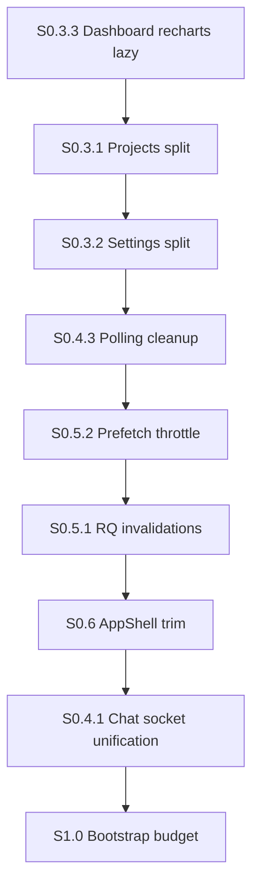

# PERFORMANCE_REMEDIATION_PLAN_V2

**Baseado em:** `PERFORMANCE_FORENSICS_V2.md`  
**Modo:** Plano only (sem implementação)  
**Pré-requisitos concluídos:** S0.1 ✅, S0.2 ✅

---

## Objetivo

Maximizar ROI pós-Shell First: reduzir TTI das rotas pesadas, deduplicar runtime (sockets/polling), e aproximar metas de bundle (`AppShell < 25 KB`, bootstrap < 280 KB gzip).

---

## Sprint roadmap recomendado

```txt
S0.3 — Route splits (Projects, Settings, Dashboard charts)
S0.4 — Realtime dedupe (sockets + polling)
S0.5 — React Query hygiene (invalidations + header summary API opcional backend)
S0.6 — AppShell final split (< 25 KB gzip)
S1.0 — Bootstrap budget + CI bundle gates
```

---

## S0.3 — Route splits (prioridade máxima)

### 3.1 Projects view-based code splitting

| Item | Detalhe |
|------|---------|
| **Problema** | `Projects-*.js` 154 KB gzip — P0 |
| **Ação** | `React.lazy` por tab: `BoardView`, `CalendarView`, `ProjectDriveWorkspace`, `ProjectFinance`, `TaskSidePanel` |
| **Arquivos** | `src/pages/Projects.tsx`, `src/components/projects/*` |
| **Ganho est.** | **−60 a −90 KB gzip** na visita inicial `/projects` (lista/grid only) |
| **Esforço** | Médio (3–5 dias) |
| **Risco** | Baixo — Suspense por tab; UX inalterada |

### 3.2 Settings section splitting

| Item | Detalhe |
|------|---------|
| **Problema** | `Settings-*.js` 92 KB gzip |
| **Ação** | Lazy por secção/tab (padrão já parcial em `SettingsLayout`) |
| **Ganho est.** | **−40 a −60 KB gzip** no primeiro paint settings |
| **Esforço** | Médio |
| **Risco** | Baixo |

### 3.3 Recharts lazy no Dashboard

| Item | Detalhe |
|------|---------|
| **Problema** | `BarChart-*.js` 102 KB gzip carrega com Dashboard |
| **Ação** | `const DashboardChart = lazy(() => import('./DashboardChart'))` |
| **Ganho est.** | **−100 KB gzip** no critical path dashboard (adiado até viewport) |
| **Esforço** | Baixo (0,5–1 dia) |
| **Risco** | Muito baixo — skeleton no card gráfico |

### 3.4 Leads kanban lazy

| Item | Detalhe |
|------|---------|
| **Problema** | Leads 37 KB + dnd-kit |
| **Ação** | Lazy `LeadKanbanBoard` quando view=kanban |
| **Ganho est.** | **−15 a −25 KB gzip** lista leads |
| **Esforço** | Baixo |
| **Risco** | Baixo |

---

## S0.4 — Realtime dedupe

### 4.1 Unificar Chat socket com singleton

| Item | Detalhe |
|------|---------|
| **Problema** | `Chat.tsx:1459` cria `io()` próprio + singleton activo |
| **Ação** | Migrar Chat para `REALTIME_WINDOW_EVENTS` / `connectRealtime` + room subscribe |
| **Ganho est.** | **−1 conexão WS**, menos CPU reconnect; latência igual |
| **Esforço** | Alto (5–8 dias) — regressão chat |
| **Risco** | **Alto** — testar envio/recebimento, reconnect, typing |

### 4.2 ClientProfile socket merge

| Item | Detalhe |
|------|---------|
| **Problema** | Segundo socket em perfil cliente |
| **Ação** | Mesmo padrão window events |
| **Ganho est.** | −1 WS em rota frequente |
| **Esforço** | Médio |
| **Risco** | Médio |

### 4.3 Eliminar polling redundante

| Item | Frequência | Ação | Ganho |
|------|------------|------|-------|
| `useInAppNotificationBadges` | 45s | Remover interval; confiar realtime + manual refresh | **−2 req/min/user** |
| `useChatNavUnreadCount` | 120s | Remover interval; manter events debounced | **−1 req/2min** + menos listInstances |
| `useTicketMenuCount` | 60s | Realtime ou stale 5min | **−1 req/min** |
| `ChatKanbanPage` | 20s | Usar só `useKanbanAttendanceSocketRefresh` | **−3 req/min** |

**Esforço total S0.4 polling:** Baixo (1–2 dias)  
**Risco:** Médio — validar offline/reconnect

---

## S0.5 — React Query hygiene

### 5.1 Invalidações cirúrgicas

| De | Para |
|----|------|
| `invalidateQueries(['floating-chat'])` | keys específicas: messages, conversations, bubble |
| `invalidateQueries(['leads'])` | `['leads', tenantId, userId]` only |

**Ganho:** Menos refetch em navegação CRM  
**Esforço:** Médio  
**Risco:** Baixo

### 5.2 Prefetch nav throttle

| Item | Detalhe |
|------|---------|
| **Problema** | Idle dispara dashboard + clients + tasks + chat warm |
| **Ação** | Prefetch só rotas com `routePreload` on hover; dashboard on idle único |
| **Ganho** | **−3 a −8 requests** nos primeiros 5s pós-login |
| **Esforço** | Baixo |
| **Risco** | Baixo — hover preload mantém UX |

### 5.3 Header summary endpoint (opcional backend)

| Item | Detalhe |
|------|---------|
| **Problema** | 3 polls + 2–4 API calls badges |
| **Ação** | `GET /api/header/summary` → notif + updates + tickets + chat unread |
| **Ganho** | **−4 a −6 requests** contínuos |
| **Esforço** | Médio (requer API — **fora escopo frontend-only**) |
| **Risco** | Baixo se backward compatible |

---

## S0.6 — AppShell < 25 KB gzip

| Item | Detalhe |
|------|---------|
| **Actual** | 31,2 KB gzip |
| **Gap** | ~6 KB |
| **Ações** | Lazy `AppShellHeaderActions`; lazy `AppShellSidebar` groups; trim lucide imports |
| **Ganho est.** | **−6 a −10 KB gzip** |
| **Esforço** | Médio |
| **Risco** | Baixo |

---

## S1.0 — Bootstrap budget

| Item | Detalhe |
|------|---------|
| **Actual** | ~338 KB gzip (entry + react-vendor) |
| **Meta master plan** | < 280 KB |
| **Ações** | Lazy `EntityDrawerContainer`; split `App.tsx` route table; review sync guards |
| **Ganho est.** | **−20 a −40 KB gzip** entry |
| **Esforço** | Alto |
| **Risco** | Médio |

---

## Ordem ideal de execução



**Rationale:** Quick wins de bundle (Dashboard chart) primeiro; maior chunk (Projects) em seguida; runtime dedupe antes de refactor socket arriscado; bootstrap por último.

---

## Matriz consolidada (Top 10)

| Sprint | Item | Ganho est. | Risco | Esforço |
|--------|------|------------|-------|---------|
| S0.3 | Projects lazy tabs | −60–90 KB gzip rota | Baixo | M |
| S0.3 | Dashboard chart lazy | −102 KB gzip adiado | Muito baixo | S |
| S0.3 | Settings split | −40–60 KB gzip | Baixo | M |
| S0.4 | Remove badge/unread polling | −4–8 req/min | Médio | S |
| S0.4 | Chat socket unification | −1 WS + CPU | Alto | L |
| S0.5 | RQ invalidations narrow | Menos refetch | Baixo | M |
| S0.5 | Prefetch throttle | −3–8 req login | Baixo | S |
| S0.6 | AppShell header lazy | −6–10 KB gzip | Baixo | M |
| S0.3 | Leads kanban lazy | −15–25 KB gzip | Baixo | S |
| S1.0 | EntityDrawer lazy bootstrap | −5–15 KB entry | Baixo | S |

**Legenda esforço:** S = small (≤1d), M = medium (2–5d), L = large (5d+)

---

## Critérios de aceite por sprint

### S0.3
- [ ] `/projects` first load gzip < 70 KB (page chunk)
- [ ] `/dashboard` first load sem `BarChart` chunk até scroll/gráfico
- [ ] Zero regressão funcional tabs

### S0.4
- [ ] Máximo **1** socket WS em `/dashboard` e `/chat` (meta final)
- [ ] Zero `setInterval` polling em header badges (realtime only)
- [ ] Kanban ops sem poll 20s

### S0.5
- [ ] Invalidações `floating-chat` reduzidas em ≥50% call sites
- [ ] Prefetch idle ≤ 2 endpoints

### S0.6
- [ ] `AppShell-*.js` gzip < 25 KB

### S1.0
- [ ] Bootstrap gzip < 280 KB
- [ ] CI falha se Projects > 100 KB gzip sem lazy

---

## Instrumentação recomendada (próximo passo)

Antes de S0.3, executar em staging:

```bash
npm run build:crm
# Adicionar vite-bundle-visualizer (devDep) — NÃO feito nesta auditoria
npx lighthouse http://localhost:8081/dashboard --only-categories=performance
```

Comparar com `[perf:shell]` e `[perf:dashboard]` logs DEV já instrumentados (S0.2).

---

## Riscos remanescentes globais

| Risco | Mitigação |
|-------|-----------|
| Chat socket merge quebra mensagens | Feature flag + testes E2E chat |
| Projects lazy causa flash tabs | Prefetch on tab hover |
| Remover polling offline gaps | Fallback poll 5min só se socket disconnected |
| Backend header summary | Fase opcional; frontend pode dedupe sem API |

---

*Plano derivado de evidências em `PERFORMANCE_FORENSICS_V2.md`. Nenhuma alteração de código nesta entrega.*
