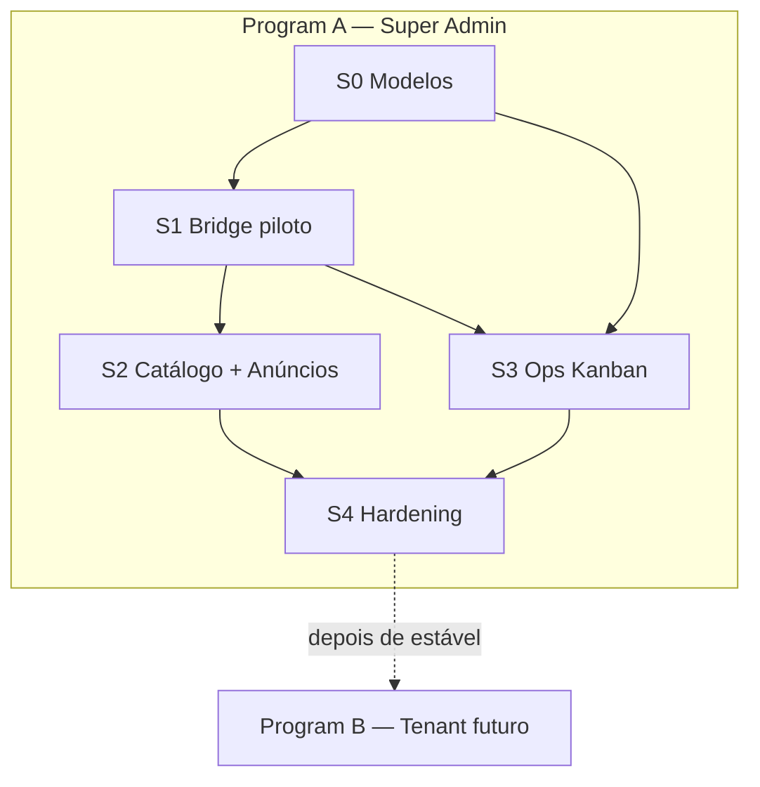

# Plano mestre — WhatsApp Oficial (PainelCRM)

**Data revisão:** 2026-08-04  
**Pacote:** [README](./README.md) · ADR [11](./11_ADR_DECISOES.md)  
**Status:** decisões D1–D3 fechadas; execução Program A (S0–S4); Program B **adiado**

---

## 1. Objetivo do programa

Implantar disparo via **API oficial Meta Cloud** aproveitando o que já existe (conta SA, HSM sync/create, campanhas, motors, Ops Kanban), com a regra:

> **Não se envia texto solto na Graph.** Só modelo Meta **APPROVED** e **vinculado**.

O trabalho está dividido em **dois programas** para não misturar escopos:

| Programa | Nome | Quando |
|----------|------|--------|
| **A** | Super Admin / plataforma SaaS | **Agora** — sprints S0–S4 |
| **B** | Plataforma do cliente (tenant CRM) | **Futuro** — após A estável |

---

## 2. Decisões canônicas (resumo)

| ID | Decisão | Doc |
|----|---------|-----|
| **D1** | Só Super Admin; catálogo `platform.*` completo; Ops auto+manual; campanhas+anúncios; Fase Modelos; builder/edição; **sem** oficial no tenant; **sem** fallback UazAPI | [01](./01_ESCOPO_PRODUTO_E_CANAIS.md) |
| **D2** | Remetente = conta `whatsapp_official_accounts` superadmin; 1 número v1; UI hub oficial | [02](./02_CONTA_META_E_REMETENTE.md) |
| **D3** | Bridge **híbrida (C)**: resolve + OfficialSend; dispatcher Meta (motors/anúncios); adapter gateway Meta (Ops) | [03](./03_BRIDGE_MOTOR_META.md), [07](./07_GATEWAY_ROUTING.md) |
| **04B/04C** | Sync → enviar → vincular; wizard anúncio APPROVED→Enviar; edição update/`name_vN`; menus session fora do HSM | [04B](./04B_CICLO_VIDA_MODELOS.md), [04C](./04C_BUILDER_ANUNCIOS_CAPACIDADES_META.md) |

Ainda abertos (fechar **durante** Program A, não bloqueiam início do S0):

| ID | Tema | Sprint típico |
|----|------|---------------|
| D4 fino | Schema vínculo event_key↔HSM | S0 |
| D5 colunas | Quais colunas Ops disparam | S3 |
| D6 UI mapa | Superfície canônica por intenção | S2–S3 |
| D7 opt-in | Consentimento marketing kanban/anúncios | S2–S3 / [08](./08_COMPLIANCE_META.md) |
| D8 flags | Allowlist + rollback | S1 / S4 / [09](./09_OBSERVABILIDADE_ROLLBACK.md) |

---

## 3. O que já existe vs o que falta (revisão)

| Área | Já existe | Falta (Program A) |
|------|-----------|-------------------|
| Conta Meta SA, Graph client | Sim | Checklist ops por ambiente |
| Sync / create HSM | Sim | Update/delete + picker vars + edição UI |
| Campanhas Meta | Sim | Alinhar a OfficialSend (opcional S4) |
| Motors platform | UazAPI texto | Vínculo HSM + bridge Meta |
| Anúncios | UazAPI texto | Wizard oficial + gate APPROVED |
| Ops Kanban | Gateway→UazAPI | Adapter Meta + auto + manual |
| Gateway `meta_cloud` | Stub | Implementar |
| Tenant `invoice.*` | UazAPI (CRM) | **Program B — não fazer agora** |

---

## 4. Program A — implantação atual (Super Admin)

### 4.1 Escopo IN

- Todas as mensagens do motor **plataforma** (`platform.*`)
- Nova senha / billing SaaS (criado, atrasado, pago) e restante do catálogo
- Ops Kanban: automações + envio manual no card
- Campanhas + anúncios (wizard Meta)
- Builder e edição de modelos ↔ Meta
- Remetente WABA Super Admin

### 4.2 Escopo OUT (desta implantação)

- Motor tenant CRM (`invoice.*`, propostas, contratos, agenda do cliente)
- WABA / WhatsApp oficial **por empresa**
- Fallback automático UazAPI em fluxo oficial
- Menus/listas só de sessão 24h no wizard de anúncio (P1 chat, não bloqueia A)

### 4.3 Sprints (detalhe)

Documento operacional: **[PLAN_SPRINTS_S0_S4.md](./PLAN_SPRINTS_S0_S4.md)**

| Sprint | Nome | Entrega-chave |
|--------|------|----------------|
| **S0** | Fundação Modelos | Conta staging; vínculo; builder P0; gate APPROVED |
| **S1** | Bridge + piloto | OfficialSend + dispatcher; 1 event_key E2E |
| **S2** | Catálogo + anúncios | Todo `platform.*` allowlist; wizard anúncio |
| **S3** | Ops Kanban | Gateway Meta; auto + manual |
| **S4** | Hardening | Obs, rollback, testes, go-live |

### 4.4 DoD Program A

- [ ] Fluxos oficiais SA só enviam com HSM APPROVED vinculado
- [ ] Catálogo platform migrável via allowlist
- [ ] Anúncio: Enviar liberado só após APPROVED
- [ ] Ops: auto + manual Meta
- [ ] Sem fallback silencioso para UazAPI
- [ ] Runbook rollback + staging verde
- [ ] ADR D1–D3 com assinatura formal

### 4.5 Ordem prática para começar amanhã

1. Preencher checklist conta Meta ([02](./02_CONTA_META_E_REMETENTE.md) §4) em staging  
2. Abrir sprint **S0** (vínculo + builder)  
3. Em paralelo: submeter HSM piloto (billing ou senha) na WABA  

---

## 5. Program B — implantação futura (plataforma do cliente)

Documento dedicado: **[PLAN_FUTURO_TENANT.md](./PLAN_FUTURO_TENANT.md)**

**Não iniciar** até Program A em produção estável.

Resumo do que será (futuro):

- Oficial para **tenants** (`invoice.created|overdue|paid`, propostas, etc.)
- Conta/WABA por tenant **ou** modelo BSP/shared number (a decidir)
- Flag `whatsapp_official_tenant_enabled` (hoje default **false**)
- Reuso de: OfficialSend, Fase Modelos, builder, gateway adapter, padrões de vínculo
- Novas investigações: billing por tenant, limites de plano, onboarding WABA, compliance por empresa

---

## 6. Riscos (revisão)

| Risco | Programa | Mitigação |
|-------|----------|-----------|
| HSM rejeitado / PENDING longo | A | S0 cedo; categorias corretas UTILITY vs MARKETING |
| Outage Meta sem fallback | A | Allowlist estreita; alertas token; runbook S4 |
| Dual-send anúncio+campanha+kanban | A | Mapa superfícies [06](./06_SUPERFICIES_SUPER_ADMIN.md) |
| Escopo “todo platform.*” estoura S2 | A | Allowlist faseada por event_key |
| Pressão para “já fazer tenant” | B | Manter Program B separado; não misturar PRs |
| PIX parity | A | CTA URL no HSM desde S1 |

---

## 7. Índice do pacote

| Doc | Papel |
|-----|--------|
| **Este** [PLAN_MESTRE.md](./PLAN_MESTRE.md) | Visão + Program A/B + revisão |
| [PLAN_SPRINTS_S0_S4.md](./PLAN_SPRINTS_S0_S4.md) | Execução Program A |
| [PLAN_FUTURO_TENANT.md](./PLAN_FUTURO_TENANT.md) | Roadmap Program B |
| [11_ADR_DECISOES.md](./11_ADR_DECISOES.md) | Decisões |
| [01](./01_ESCOPO_PRODUTO_E_CANAIS.md) … [10](./10_TESTES_E_AMBIENTES.md) | Investigações |
| [04B](./04B_CICLO_VIDA_MODELOS.md) / [04C](./04C_BUILDER_ANUNCIOS_CAPACIDADES_META.md) | Modelos / builder / anúncios |

---

## 8. Histórico de revisão

| Data | Nota |
|------|------|
| 2026-08-03 | Pacote investigação + D1–D3 + S0–S4 inicial |
| 2026-08-04 | **Revisão mestre:** consolidação; separação explícita Program A (agora) vs Program B (futuro tenant) |
