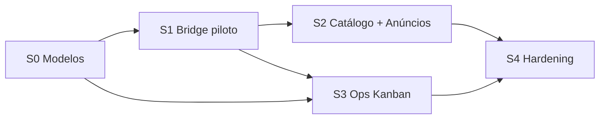

# Plano de sprints — Program A: Super Admin (S0–S4)

**Data:** 2026-08-03 · **Revisão:** 2026-08-04  
**Programa:** **A** (implantação **atual**) — ver [PLAN_MESTRE.md](./PLAN_MESTRE.md)  
**Futuro (tenant):** [PLAN_FUTURO_TENANT.md](./PLAN_FUTURO_TENANT.md) — **não** faz parte destes sprints  
**Pré-requisitos ADR:** D1 + D2 + D3 fechados · 04C baseline  

**Fora deste plano:** tenant CRM · WABA por cliente · fallback UazAPI em fluxos oficiais

---

## Visão geral

| Sprint | Nome | Objetivo | Depende |
|--------|------|----------|---------|
| **S0** | Fundação Modelos | Conta ok, builder P0, vínculo HSM, gate APPROVED | D1 D2 04B 04C |
| **S1** | Bridge híbrida | Resolve + OfficialSend + dispatcher Meta + piloto 1 evento | D3 S0 |
| **S2** | Catálogo platform + anúncios | Restante `platform.*` + wizard anúncio oficial | S1 |
| **S3** | Ops Kanban | Adapter gateway Meta + auto + manual no card | S1 S0 vínculos coluna |
| **S4** | Hardening | Observabilidade, rollback, testes staging→prod | S2 S3 |

Duração indicativa: **1–2 semanas** por sprint (ajustar à capacidade do time).  
S2 e S3 podem **sobrepor** após S1 (motors/anúncios vs Ops).

---

## S0 — Fundação Modelos (gate de disparo)

**Meta:** nada dispara oficial sem HSM APPROVED vinculado.

### Entregas

1. Ops: checklist conta Meta ([02](./02_CONTA_META_E_REMETENTE.md) §4) em staging.
2. Builder P0 ([04C](./04C_BUILDER_ANUNCIOS_CAPACIDADES_META.md)):
   - Picker de variáveis de negócio → `{{n}}`
   - `update` / `delete` template no client Graph + UI editar
3. Persistência de **vínculo** `event_key` ↔ HSM (+ `meta_param_map`) — fechar D4 fino neste sprint.
4. UI Super Admin: badge “Pronto / Sem vínculo / PENDING” por evento platform.
5. Gate runtime: helper `assertOfficialTemplateReady(eventKey)` (S1+).

### Critérios de aceite

- [ ] Sync + create + edit/resubmit em staging
- [ ] ≥1 evento (ex. `platform.billing.charge.created`) com HSM APPROVED + param map
- [ ] Sem vínculo → helper not ready (teste unitário)

### Fora de S0

- Envio real motors/Ops/anúncios (S1+)
- Qualquer trabalho tenant (Program B)

---

## S1 — Bridge híbrida (D3) + piloto

**Meta:** caminho Graph partilhado; 1 evento platform envia de verdade.

### Entregas

1. `platformWhatsAppSenderResolve` (D2).
2. `officialWhatsAppSend` — template + erros retryable.
3. Branch Meta em `dispatchPlatformWhatsAppText` (+ retry worker).
4. Orchestrator oficial: map params → HSM (não texto UazAPI).
5. Piloto: **`platform.billing.charge.created`** (ou password reset) E2E staging.
6. `provider` + `wamid` na delivery.
7. PIX: CTA URL no HSM (sem `sendPixButton` no path oficial).
8. Testes dispatcher Meta mock; classificador Graph básico.
9. Allowlist só do event_key piloto.

### Critérios de aceite

- [ ] Piloto APPROVED → Graph aceita / wamid
- [ ] Sem vínculo / Meta down → fail explícito, **sem** UazAPI
- [ ] Allowlist limita blast radius

### Fora de S1

- Catálogo completo; wizard anúncio; Ops gateway; tenant

---

## S2 — Catálogo platform.* + anúncios oficiais

**Meta:** mensagens SA do motor plataforma + anúncios com gate Meta.

### Entregas

1. Vincular/migrar catálogo `platform.*` com allowlist gradual.
2. Password reset + change logado no path oficial.
3. Wizard anúncio ([04C](./04C_BUILDER_ANUNCIOS_CAPACIDADES_META.md) §3): canal oficial → HSM → APPROVED → Enviar.
4. Worker anúncio branch Meta.
5. Histórico com template + status.
6. Compliance marketing/opt-in mínimo para anúncios ([08](./08_COMPLIANCE_META.md)).

### Critérios de aceite

- [ ] Allowlist pode cobrir 100% catálogo platform em staging
- [ ] Anúncio oficial: Enviar só com APPROVED; dispatch Graph
- [ ] Canal legado UazAPI do anúncio continua se escolhido explicitamente

### Fora de S2

- Ops Kanban (S3); menus session; tenant CRM

---

## S3 — Ops Kanban (auto + manual)

**Meta:** funil de registro (Operação) via Meta.

### Entregas

1. Adapter `meta_cloud` no gateway → `OfficialSend` ([07](./07_GATEWAY_ROUTING.md)).
2. Vínculo HSM por coluna (fechar lista D5) + Phase2 / checkout abandonado.
3. `opsLeadGatewaySend` path oficial.
4. Envio **manual** no card (`ChatKanbanOpsLeadDialog`).
5. Timeline com wamid/status.
6. Smoke + testes gateway.

### Critérios de aceite

- [ ] Automação coluna v1 envia HSM Meta
- [ ] Manual exige APPROVED
- [ ] Not ready → não cai UazAPI

### Fora de S3

- Lote nativo (usar campanhas/anúncios); Program B

---

## S4 — Hardening / go-live (Program A)

**Meta:** produção segura sem fallback.

### Entregas

1. Observabilidade ([09](./09_OBSERVABILIDADE_ROLLBACK.md)).
2. Runbook rollback (desligar allowlist/canal; **sem** auto-fallback).
3. Matriz ([10](./10_TESTES_E_AMBIENTES.md)) verde em staging.
4. Webhook status → delivery (mínimo).
5. Rate limits; docs; ADR assinado.
6. Opcional: campanhas → `OfficialSend`.

### Critérios de aceite

- [ ] Staging completo + simulacro rollback
- [ ] Prod: allowlist inicial → expandir
- [ ] DoD Program A ([PLAN_MESTRE.md](./PLAN_MESTRE.md) §4.4)

### Depois de S4

Só então avaliar abertura de **[Program B — tenant](./PLAN_FUTURO_TENANT.md)**.

---

## Riscos e mitigação (Program A)

| Risco | Mitigação |
|-------|-----------|
| Meta rejeita HSM | S0 cedo; UTILITY vs MARKETING |
| Sem fallback = outage | Allowlist; alertas token; runbook S4 |
| Dual-send | Mapa [06](./06_SUPERFICIES_SUPER_ADMIN.md) |
| Catálogo grande | Allowlist faseada em S2 |
| Gateway atrasa | S3 após S1; motors não bloqueiam |
| Scope creep tenant | Recusar PRs B; apontar para PLAN_FUTURO |

---

## Definition of Done (Program A)

- D1 entregue no Super Admin (catálogo platform, anúncios wizard, Ops auto+manual, modelos).
- Nenhum fluxo oficial usa UazAPI em silêncio.
- Fase Modelos operacional.
- Program B **não** iniciado por acidente.

---

## Ligações

- Mestre [PLAN_MESTRE.md](./PLAN_MESTRE.md) · Futuro [PLAN_FUTURO_TENANT.md](./PLAN_FUTURO_TENANT.md)  
- ADR [11](./11_ADR_DECISOES.md) · Bridge [03](./03_BRIDGE_MOTOR_META.md) · Gateway [07](./07_GATEWAY_ROUTING.md)  
- [04B](./04B_CICLO_VIDA_MODELOS.md) · [04C](./04C_BUILDER_ANUNCIOS_CAPACIDADES_META.md)
